- [Module 13: Ajax and Fetching Data](#module-13--ajax-and-fetching-data)
  * [74 - Ajax and APIs](#74---ajax-and-apis)
    + [What is an API?](#what-is-an-api-)
    + [JSON](#json)
    + [AJAX](#ajax)
      - [Public API list](#public-api-list)
  * [75 - CORS and Recipes](#75---cors-and-recipes)
    + [Query Parameters](#query-parameters)
    + [CORS](#cors)
      - [What is CORS?](#what-is-cors-)
    + [CORS policy](#cors-policy)
      - [Babel](#babel)
      - [Browserlist](#browserlist)
      - [Proxy](#proxy)
  * [76 - Dad Jokes](#76---dad-jokes)
    + [Headers](#headers)
    + [Getting a Random Index](#getting-a-random-index)
    + [Loading State & CSS Loader](#loading-state---css-loader)
  * [77 - Currency Converter](#77---currency-converter)
    + [Caching the Rates](#caching-the-rates)
    + [Converting](#converting)
    + [Hooking Up The UI](#hooking-up-the-ui)
      - [Input Event on a Form](#input-event-on-a-form)
      - [Wiring up Handlers](#wiring-up-handlers)
      - [Formatting Currency using Number Format API](#formatting-currency-using-number-format-api)

---

# Module 13: Ajax and Fetching Data

## 74 - Ajax and APIs

Using **async/await** and **promises** is very useful when fetching data from an **API**.

### What is an API?

An **API** is a term that is thrown around a lot. It stands for **Application Programming Interface**, and it is a way to talk to a machine in a somewhat standardized procedure.

When you are building any type of app, that app, the client, needs to talk with server that exists somewhere. It does not matter if you are building a web app, mobile app etc. If you are building a web app, the app (the client) would be the web browser.

For example, if you had a twitter app, you would need to be able to pull down your most recent tweets, send tweets, like tweets, reply to tweets etc. All that functionality is based upon what is called an API.

Most services with a public facing website will try to surface their data and functionality via an API.

As a developer, a lot of our work is just pulling data from APIs.

Let's start by taking a look at how we can go to another service and pull that data into our application in order to display it.

We will go over two examples, one with pizza and one with GitHub.

The most popular way to pull data from an API is using a URL that you can hit with some associated data, like we are doing with "wesbos" in the url https://api.github.com/users/wesbos used in the Github example below.

### JSON

In the example below, the API will respond with what is called **JSON**.

 2:27

We have discussed **JSON** a few times. It stands for **Javascript Object Notation**, and it is a good way to transport JavaScript objects between servers and clients.

Open a browser and navigate to this endpoint: https://api.github.com/users/webbos

That is part of the Github API.

_Note: in the videos, Wes is using a chrome extension that makes viewing JSON files easier called JSONViewer. If you are going to be working with JSON or APIs,Wes recommends downloading it._

Although what is returned looks like an object, it's actually just a string.

If we copy that string into the console and assign it to a variable called `data`, we can log it and access it from the console like so.

 3:33

As you can see, it is just a huge string.

If you do `typeof data` it would return string.

That means that if you wanted to grab one of the properties from the data returned such `company`, if you try to use `data.company` it will return undefined because it's just a string.

The server returns a string, and it is up to us, the developers, to turn it back into a JavaScript object.

To do that, we can wrap `data` in a `JSON.parse()` and that will return to us a proper object, which we can then store in a variable.

```js
const dataObj = JSON.parse(data);
```

Now we can access the object properties using **javascript dot notation**.

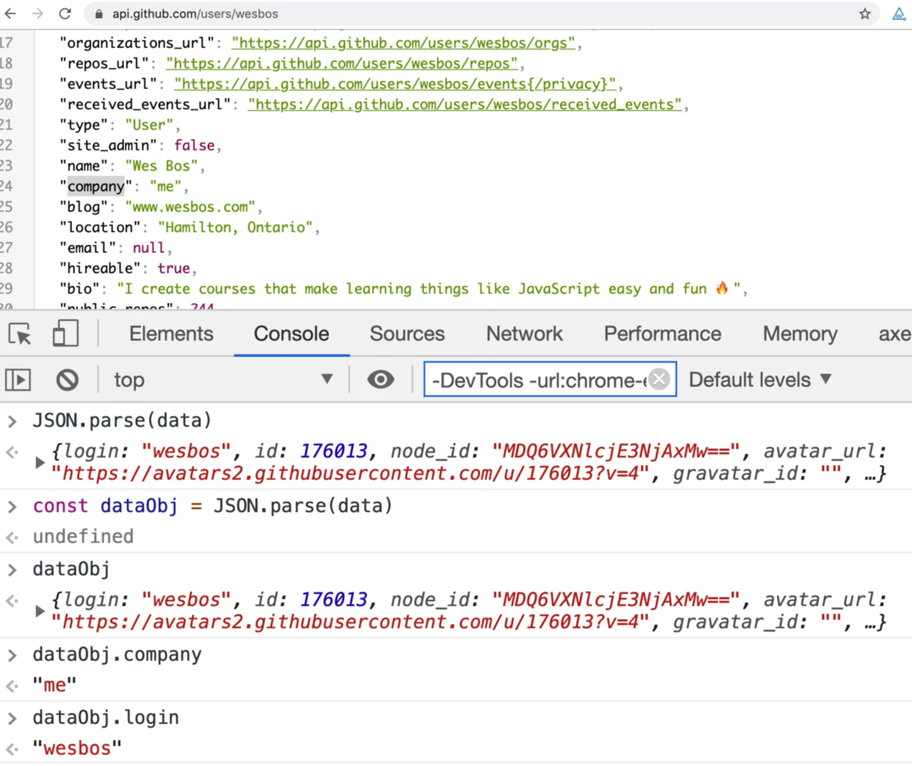 4:29

Lots of APIs allow you to pull data from their server onto your own. There are many that do not allow it and many that require API keys (which we will go into later). For now, we will be working with wide open APIs that do not require any authentication.

In the `playground` folder and create a new file called `apis.html`.

### AJAX

You will often referred to what we are doing in this video as **AJAX**, which stands for **Asynchronous Javascript and XML**.

We know what **asynchronous** is and Javascript, but you may not know what **XML** is.

**XML** is another way that you can receive data and it looks a lot like HTML but is not HTML.

XML was used in the past but has generally been replaced with JSON as the preferred way to send data via APIs, but you might still encounter it. Wes has only had to work with XML once during his 12 year career.

When people say "AJAX", they mean fetching data from an API and displaying it on the page.

Open up the HTML page we created and give add the base HTML and a script tag within the body tag.

```HTML
<!DOCTYPE html>
<html lang="en">

<head>
  <meta charset="UTF-8">
  <meta name="viewport" content="width=device-width,initial-scale=1.0">
  <title>APIs</title>
  <link rel="stylesheet" href="../base.css">
</head>

<body>
  <script>
  </script>
</body>

</html>
```

The first thing we will do is store the URL in a variable. That is not necessary but is much easier.

Name the variable `endpoint`.

\*Endpoint\*\* is a fancy word for the URL that you need to visit in order to get the data.

```js
const endpoint = "https://api.github.com/users/webbos";
```

In order to get that data, we will use `fetch` which exists within Javascript._ (There are some other libraries that are used, specifically Axios but the fetch library is very good and comes built in to all browsers)._

To grab that data we will call `fetch` and then pass it the endpoint that we want to call, which will in turn return a Promise.

```js
const wesPromise = fetch(endpoint);
console.log(wesPromise);
```

 7:52

To check if it worked, you can go to the network tab and refresh the page. When you do that, you will see all the requests that have happened on the page. This allows you to see when a request was sent out, and when it came back with the data.

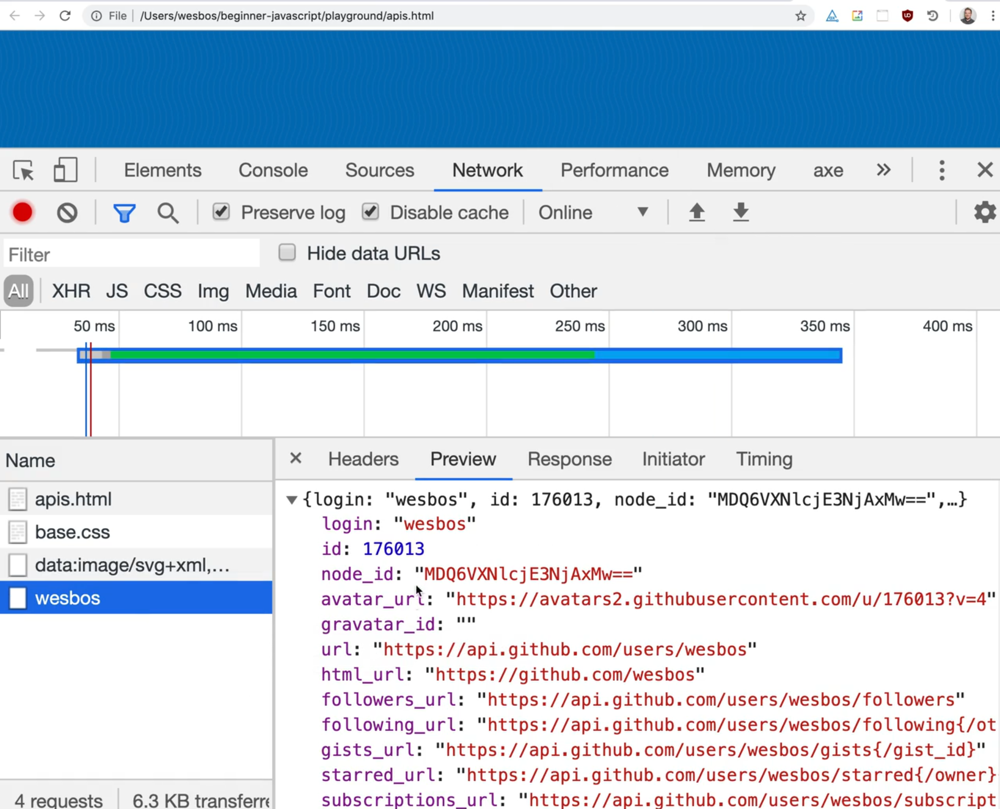 8:13

If we want to get that data back into JavaScript, how do we do that? We can use `.then()`.

Before we do that, let's make a quick error handler first.

```js
function handleError(err) {
  console.log("OH NO!");
  console.log(err);
}
```

Fetch that data and log it to the console. 👇

```js
const endpoint = "https://api.github.com/users/webbos";

const wesPromise = fetch(endpoint);
wesPromise
  .then((data) => {
    console.log(data);
  })
  .catch(handleError);
```

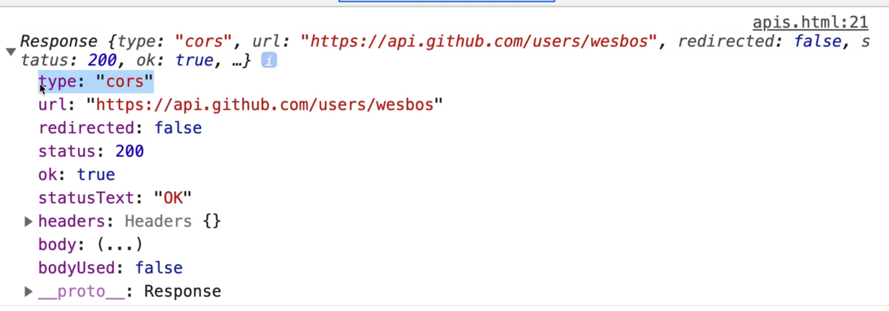 9:15

Now when you refresh the page, you will see that we no longer get a promise. Instead we get the response object you see above 👆

The response tells us the type is **CORS** which we will talk about in a second. We also have all these properties on the response object but where do we get the data?

If you expand the properties like `headers` and `body`, you won't find it.

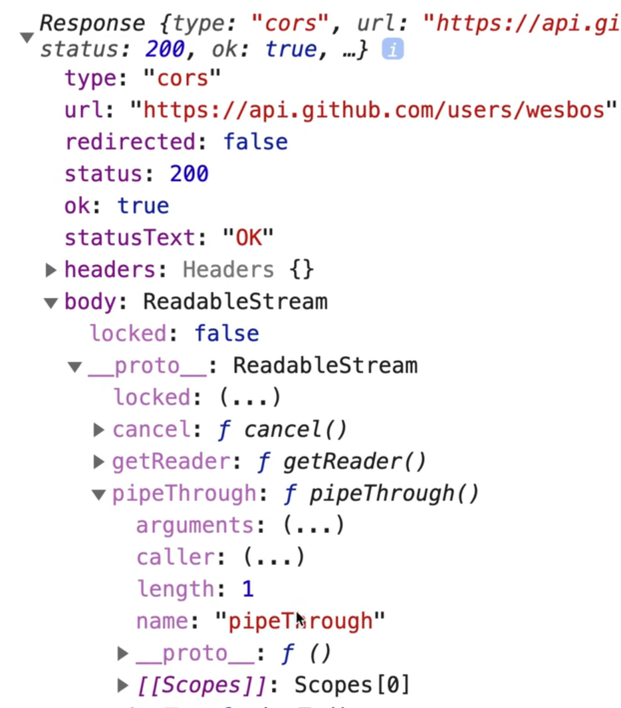 9:27

As you can see, the data is nowhere to be found.

Before we can access the data, there is another step that needs to happen.

Right now we have the data streaming into the browser and we have assigned it to the variable `response`. At this point, the data is not fully downloaded and the data type is unknown.

The `fetch` API can be used to fetch any type of data, whether it is JSON, an image or raw text. It does not assume the response type of the data returned.

To actually get the data, you must tell the browser to convert the data from JSON to a javascript object once it is finished downloading.

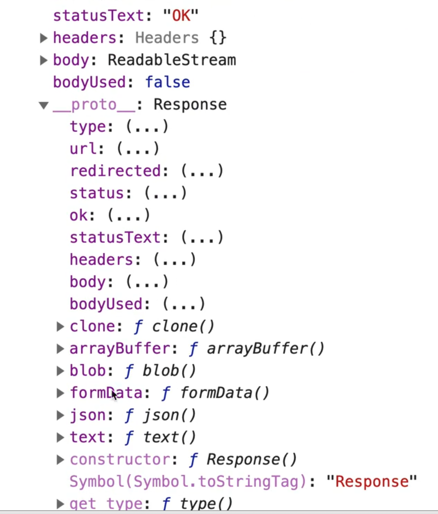 10:30

Take a look at the prototype of the response object, and you will see that there is a number of methods on the response.

In our case, we want to use `json()`. We will return `response.json()` which will return another promise.

```js
wesPromise
  .then((response) => {
    return response.json();
  })
  .catch(handleError);
```

To get the actual data, we must chain on another `.then()` and then we can log the data.

When the page refreshes, after a split second, you should see that we have the full object logged to the console. There is no need to run `JSON.parse()` on the data because `response.json()` will take care of that.

Remember: When using `fetch`, you need to use a double promise to actually get the data. The first promise gets the response and the second one takes the response and converts it into JSON.

Now we can log information from the data we fetched.

```js
wesPromise
  .then((response) => {
    return response.json();
  })
  .then((data) => {
    console.log(data);
    console.log(data.blog);
    console.log(data.name);
    console.log(data.location);
  })
  .catch(handleError);
```

 11:40

Let's go ahead and display some info about the user.

A paragraph tag to the HTML with a class of "user", and then go ahead and select it in the script tag.

```HTML
<body>
  <p class="user"></p>
  <script>
    function handleError(err) {
      console.log("OH NO!");
      console.log(err);
    }

    const userEl = document.querySelector(".user");

    const endpoint = "https://api.github.com/users/wesbos";

    const wesPromise = fetch(endpoint);
    wesPromise
      .then((response) => response.json())
      .then((data) => {
        console.log(data);
        console.log(data.blog);
        console.log(data.name);
        console.log(data.location);
        userEl.textContent = `${data.name} - ${data.blog}`;
      })
      .catch(handleError);
  </script>
</body>
```

 12:40

As you can see, it pops up.

One other thing you can do is set the text content of the element as loading before we replace it with the data, so for a split second you will see "loading...".

Add the following code 👇

```js
userEl.textContent = "loading....";
const wesPromise = fetch(endpoint);
```

Now let's refactor this to use **async/await**.

Create an async function called `displayUser` which takes in a `username`. Take all the code we wrote after selecting the element and put it into the `displayUser` function.

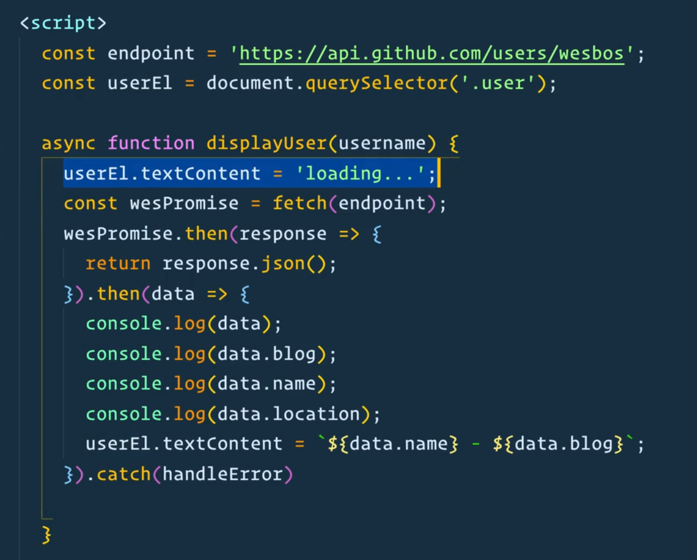 13:39

Now let's go line by line. Leave the first line as is.

The promise where we fetch the endpoint can now be switched to `await` and that no longer is a Promise but is a response. Then we can get the data by awaiting `response.json()` like so 👇

```js
async function displayUser(username) {
  userEl.textContent = "loading...";
  const response = await fetch(endpoint);
  const data = await response.json();
  console.log(data);
  console.log(data.blog);
  console.log(data.name);
  console.log(data.location);
  userEl.textContent = `${data.name} - ${data.blog}`;
}
```

The only thing left is to call `displayUser` on page load.

Let's go ahead and do that to display the user.

Replace the `endpoint` variable with `baseEndpoint` and make another variable for the `usersEndpoint` like so 👇

```js
const baseEndpoint = "https://api.github.com";
const usersEndpoint = `${baseEndpoint}/users`;
```

To fetch the username that was passed in, modify the code like so 👇

```js
const response = await fetch(`${usersEndpoint}/${username}`);
```

That modification allows us to generate the endpoint on the fly based on what username was passed in as an argument.

To test this, let's try calling it from the bottom of our script tag with the user `stolinski`.

```html
<script>
  const baseEndpoint = "https://api.github.com";
  const usersEndpoint = `${baseEndpoint}/users`;
  const userEl = document.querySelector(".user");

  async function displayUser(username) {
    userEl.textContent = "loading...";
    const response = await fetch(`${usersEndpoint}/${username}`);
    const data = await response.json();
    console.log(data);
    console.log(data.blog);
    console.log(data.name);
    console.log(data.location);
    userEl.textContent = `${data.name} - ${data.blog}`;
  }

  function handleError(err) {
    console.log("OH NO!");
    console.log(err);
  }

  displayUser("stolinski");
</script>
```

One thing we are not doing is catching the error so if something went wrong, such as a typo in the url assigned to `baseEndpoint`.

To fix that, let's add a catch and pass it our error handler function like so 👇
`displayUser("stolinski").catch(handleError);`

 16:32

_🔥HOT TIP: You can filter out just AJAX request from the Network tab by clicking XHR. 👇_

 16:11

Next let's modify the `handleError` function to show the error by replacing the paragraph text content.

```js
function handleError(err) {
  console.log("OH NO!");
  console.log(err);
  userEl.textContent = `Something went wrong: ${err}`;
}
```

 16:55

We wil do one more example in the next lesson.

#### Public API list

It is hard to find good APIs that are public and don't require API keys. There is a good list of them in the github repo https://github.com/public-apis/public-apis

 17:34

You can scroll through and find different APIs for all different things.

---

## 75 - CORS and Recipes

In this video we are going to build an app that searches for a recipe based on a keyword and then we will display the data.

We will use a real API in this example so Wes can show us how to overcome common hurdles you will face when working with APIs. Working with APIs can be frustrating so it will be helpful to know how to approach the common pitfalls when you try it yourself.

We will be using the API www.recipepuppy.com.

 00:52

If you look at the docs, the way this API works is you go to the url and pass `i` (which is ingredients), pass `q` ( which is your omelet) and pass `p` (which is your page). On the homepage, you can see that there are additional parameters you can pass.

`http://www.recipepuppy.com/api/?i=onions,garlic&q=omelet&p=3`

### Query Parameters

 1:08

`i`, `q` and `p` are all parameters. Let's talk about **parameters**.

Sometimes when you got to a URL, you see these question marks on the end.

Even when you submit a form they are there. 👇

 1:22

Those are referred to as **query parameters** or **query params**. Let's break down the query params from the url above.

```js
?i=onions,garlic&q=omelet&p=3
```

The query parameters portion of a url will _always start with a question mark_ and is followed by the first parameter. Additional parameters are separated by an ampersand `&`. That is how you can pass multiple parameters.

```js
?
i=onions,garlic
&
q=omelet
&
p=3
```

In the query string above...

- `i` is being passed multiple ingredients. _Note: using commas to separate the multiple items is not a standard thing, it is just how that API works._

- `q` is the recipe you are looking for.

- `p` is page, which is how this API handles pagination.

Parameters are never standard, every API implements them a little bit differently so you always have to go and read the docs.

We will be working out of the `/exercises/75 - CORS and Recipes/` directory.

This example will include a form with an input where the user can type a keyword, and they should be returned a list of recipes, their ingredients and a thumbnail image.

We won't worry about the UI just yet, let's just getting it working.

 2:31

In the empty `scripts.js` file, let's add the base url.

Next, create an async function that takes in a parameter and fetches that from the endpoint, and call it on runtime.

```js
const baseEndpoint = "http://www.recipepuppy.com/api";

async function fetchRecipes(query) {
  const res = await fetch(`${baseEndpoint}?q=${query}`);
  const data = await res.json();
}
fetchRecipes("pizza");
```

Let's start fetching the data.

Open up the dev tools and then refresh the page. You should see the following error 👇

 4:30

> Access to fetch at 'http://www.recipepuppy.com/api?q=pizza' from origin 'null' has been blocked by CORS policy: No 'Access-Control-Allow-Origin' header is present on the requested resource. >If an opaque response serves your needs, set the request's mode to 'no-cors' to fetch the resource with CORS disabled.
> www.recipepuppy.com/api?q=pizza:1 Failed to load resource: net::ERR_FAILED
> scripts.js:6 Uncaught (in promise) TypeError: Failed to fetch

If you look at the network tab, and filter for XHR, you will see the request but there is no response data.

 4:57

### CORS

What happened there is the browser blocked it because of something called **CORS**.

#### What is CORS?

CORS stands for **Cross Origin Resource Sharing**. The "CO" in CORS stands for **cross origin**.

What are **origins**? Take the two websites: wesbos.com and github.com. Those are both origins. Domain names are origins.

If you want to share data between two origins like wesbos.com and github.com, by default you cannot.

You are only permitted to share data between the same domain name. For example it would be fine to share data from wesbos.com to wesbos.com/about.

As soon as you go cross origin from one domain name to another, then you start getting in trouble because that is a security issue in the browser.

For example, let's say you were logged into your bank at bank.com while you were also running code from wesbos.com. The javascript you are running on wesbos.com should not be able to reach into bank.com, because that would be a security issue. So by default, websites cannot talk to each other from one domain to another.

### CORS policy

What happens if you do need to pull data from one website to another, like we need to do with recipepuppy.com? How can we get those two websites to talk?

In order for the two websites to talk, the website from which the data is being pulled has to implement something called a **CORS policy**

A **CORS policy** is something that happens on the server, there is nothing you can do in the browser about this.

The server will have a CORS policy that has some rules such as "wesbos.com is allowed to ask for data and we will return it".

In our example, the recipepuppy.com server must specify which domain names are allowed to transfer data from it, and that has to happen on the server of the person that has the data.

Before we can get use CORS, we need an origin. If you look at the error we got in the console, it says 👇

> origin 'null' has been blocked by CORS policy: No 'Access-Control-Allow-Origin' header is present on the requested resource.

That error is occurring because we are accessing and running the code off of file access.

Whenever you see an error like the one above, the first thing you need to do is no longer run the code from the file. Instead, you need to run it on a server.

Let's get a server up and running, so we can see if that fixes the problem (in most cases, it will).

In the terminal, navigate to our `exercises/75 - CORS and Recipes/` directory.

Let's select a server to use, which could be any server. You could use:

- you could use browsersync
- upload the code to CodePen
- use Parcel

Let's start by getting Parcel running. In the terminal, run the `npm init` command.

 9:17

You need to put a package name (which you can call anything, Wes chose `dogrecipes`) and then you just keep hitting enter to accept the default for the next few questions, as shown above.

Once the package is finished installing, run `npm install parcel-bundler` in the terminal to install Parcel.

Once that is complete, there should be a `packages.json` file in your folder (there will also be a `packages-lock.json` file). This packages file is where we can go and change our scripts, just like we have in previous lessons.

Open the file and modify the scripts start command like so 👇

```json
 "scripts": {
    "start": "parcel index.html"
  },
```

When we run `npm start`, you should see a message in the terminal that a server has been started on localhost:1234 or another port.

 10:04

Open that server in the browser and take a look at the error we are now getting in the console. 👇

 10:11

It is complaining that "regeneratorRuntime is not defined".

This issue has nothing to do with CORS. \_(Note: If you do not have this issue, and instead see another CORS issue, skip ahead to that section)

#### Babel

`regeneratorRuntime` is a thing called **Babel**. Some Javascript functionality, like async/await and backticks are relatively new to Javascript, and older browsers do not support those functionalities. However, sometimes you need to support older browsers.

Babel helps with this.

It will take your modern javascript code and transpile it into Javascript that is runnable on older browsers like IE or older Safari. That will give you Javascript that works the same way. It has just been transpiled into the equivalent in older Javascript with callbacks and things like that.

The weird thing about Babel is it wants to compile async/await, even though in most cases you don't need to because it is available in almost all browsers and has been for a few years.

#### Browserlist

Since it's unnecessary, we need to tell Babel not to transpile async/await. The way we can get around that is to go to the `package.json` and somewhere in there we will add a `browerslist` property to the JSON file.

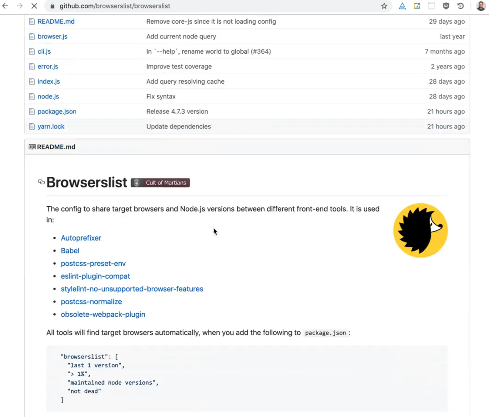 12:40

`browserslist` is a package that allows you to define which browsers you are currently supporting.

There is a huge list of filtering options like less than 1% usage, blackberry 7, etc. You can just write them in plain english and that will convert them. That is what tells babel what to transpile, and what to just leave as is.

_Note: Within `packages.json` you must use double quotes instead of single because it is JSON._

```json
 "browserslist": [
    "last 1 chrome versions"
  ],
```

Wes likes to use the filter above because it tricks babel into thinking you are supporting the latest and greatest and then it won't actually transpile it.

Now when you look at the page the error should be gone (you may see other errors which is fine).

 13:24

If you do have issues, kill the server by pressing Ctrl + C while focused in the terminal. Then open the folder up in your finder, and find the `cache/` and `dist/` folders within there and just delete those.

 13:47

Now run `npm run start`, and that will fire it up again.

Problem number two, we have solved by using browserslist (you might not need to do that in the future).

The next problem is kind of the same error we had in the first issue.

 14:06

As you can see, even though we are now running our code on a server instead of access it right from the file, we are still getting an error except this time it is complaining about localhost:1234 not origin.

It seems like recipepuppy is complaining and saying, nope, you cannot use this in the browser.

Let's take a look at the docs because sometimes they will offer solutions such as use a callback. However, if you take a look yourself, you will see there is nothing on the page that suggests that we should or shouldn't use it with Javascript, which is a bit of a bummer.

So what are you supposed to do if the CORS policy doesn't work or they don't have a CORS policy on it? It's not like they are explicitly blocking websites from accessing it, it's more likely they just have never implemented a CORS policy.

If you look at the website, you can see it has a link to "Recipe Puppy for iPhone", and if you were using this in an iPhone app, you are not restricted to CORS because there are no multiple tabs open and things like that.

#### Proxy

So what is the solution?

The solution is that the request would work if it was made from anything other than a browser.

If we were to request the same data from the API using Node.js, PHP, Ruby on Rails or anything else, than it is totally allowed.

So the solution is instead of going directly from localhost to recipepuppy, we need to put something in between called a **proxy**.

It will work like this: localhost will send the data to the proxy. Then the proxy will do a request to recipepuppy on the server side, which recipepuppy allows so it will send data back to the proxy, and then the proxy sends it back to the localhost.

To use a proxy you either have to build one yourself which requires building an entire server that handled your requests and locked it down or in some cases, where it is something silly with no usernames, passwords or nothing sensitive being sent, you can use a **CORS** proxy that people have provided and you can just stick in front of your url and it will proxy the data for you.

To find one, just google CORS proxy.

 17:28

Wes has found that the https://cors-anywhere.herokuapp.com one works the best.

 17:37

If you go to the website you will just see the text above, but the way that it works if you take the url and paste it in front of your urls and that will proxy that data for you.

Modify the code like so 👇

```js
const baseEndpoint = "http://www.recipepuppy.com/api";

async function fetchRecipes(query) {
  const res = await fetch(
    `https://cors-anywhere.herokuapp.com/${baseEndpoint}?q=${query}`
  );
  const data = await res.json();
}
fetchRecipes("pizza");
```

**To be absolutely clear here: you are sending you data through a random web server that is controlled by who knows who.** Never use this for something that has sensitive data like passwords, emails or login information. If that is the case, you have to run your own server.

In our case, we are just using it to learn and look up recipes so it doesn't matter that someone random may have access to that data.

Let's refactor the code slightly to the put proxy url in it's own variable like so 👇

```js
const baseEndpoint = "http://www.recipepuppy.com/api";
const proxy = "https://cors-anywhere.herokuapp.com/";

async function fetchRecipes(query) {
  const res = await fetch(`${proxy}${baseEndpoint}?q=${query}`);
  const data = await res.json();
}
fetchRecipes("pizza");
```

Now when you refresh the page, the error should be gone. Let's also console log the data.

 19:07

Now that we finally have the data working, we need to loop through the data and show them based on what the user has searched for.

Let's make an event listener and handler for the submit event when the user enters a keyword and hits the submit button.

```js
function handleSubmit(event) {
  event.preventDefault();
  console.log(event.currentTarget);
}

form.addEventListener("submit", handleSubmit);
fetchRecipes("pizza");
```

To grab the value of the query we can modify the code to use `event.currentTarget.query.value` because the input has a `name` attribute of `query`.

 20:25

If you were to refresh the page, you should see pizza logged.

Next, we will some sort of loading screen because we don't want the user searching for many things over and over again while the API is still searching.

There are a couple of ways to do that.

The easiest is if you go to the input button and add a `disabled` attribute. That will stop the user from actually clicking it.

```html
<button disabled type="submit">Submit<button></button></button>
```

There is no visual different there, so let's add a style for buttons with the disabled attribute

```css
button[disabled] {
  opacity: 0.2;
}
```

 21:40

Now it is clear that the button is disabled.

Another trick you can do is take a fieldset and wrap all your inputs in that fieldset and then put a disabled attribuet on the fieldset itself. That will prevent someone from being able to type in the box or click on the buttons as well.

Either one is totally fine, as long as the user is prevented from making multiple requests at the same time.

Add a name attribute to the button of `name="submit"`.

Now in the script file we can access the submit button within the `handleSubmit` function, disable it, and then call `fetchRecipes` and pass it what the user searched.

```js
function handleSubmit(event) {
  event.preventDefault();
  const form = event.currentTarget;
  //turn the form off
  form.submit.disabled = true;
  //submit the search
  fetchRecipes(form.query.value);
}
```

Next, modify the `fetchRecipes` function to return the data instead of just logging it.

```js
async function fetchRecipes(query) {
  const res = await fetch(`${proxy}${baseEndpoint}?q=${query}`);
  const data = await res.json();
  return data;
}
```

NNow we can await the fetchRecipes by marking our `handleSubmit` function as async.

```js
async function handleSubmit(event) {
  event.preventDefaut();
  console.log(form.query.value);
  const el = event.currentTarget;
  // turn the form off
  el.submit.disabled = true;
  // submit the search
  const recipes = await fetchRecipes(el.query.value);
  console.log(recipes);
  el.submit.disabled = false;
}
```

When we submit the form now and search for something like "chicken", it will disable the button, fetch and log the recipes, and finally re-enable the button.

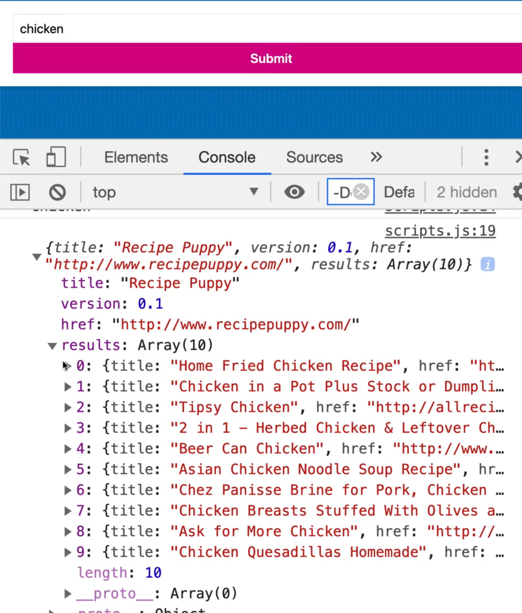 24:45

Next, make another function called `displayRecipes` which takes in the array of recipe and returns the HTML that will be used to display those recipes.

How can we pass the recipes array from the `handleSubmit`?

If you log `recipes`, you will see that it actually return an object and the recipes array lives on the `results` property of the `recipes` object. We can use that property to pass the array like so `displayRecipes(recipes.results);`.

`displayRecipes` will loop through each recipe and return some generated HTML, such as the title, ingredients and a thumbnail image if there is one (which we will check for with a conditional).

This might look a little confusing because you can nest template tags within template tags as deep as you want.

Below we have one template tag and inside of that template tag we can run javascript logic, and also return another template tag which in turn will have template tags inside of them.

```js
function displayRecipes(recipes) {
  console.log("Creating HTML");
  const html = recipes.map(
    (recipe) => `<div class="recipe">
      <h2>${recipe.title}</h2>
      <p>${recipe.ingredients}</p>
      ${
        recipe.thumbnail &&
        ``
      }
    </div>`
  );
  recipesGrid.innerHTML = html.join("");
}
```

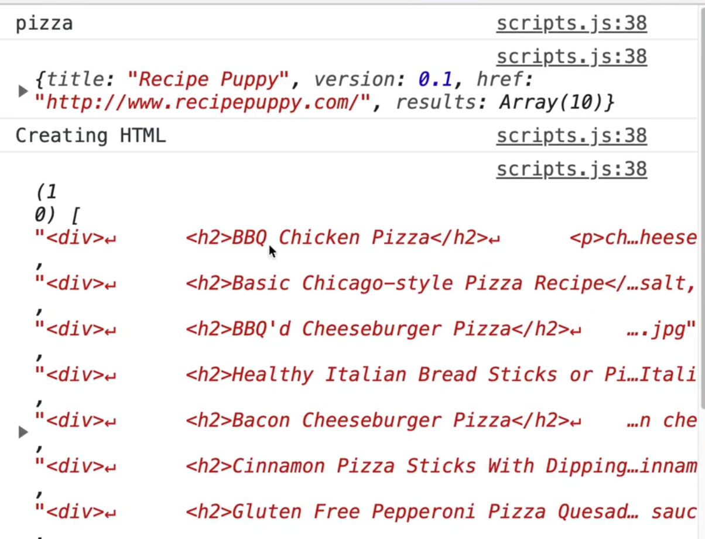 28:24

As you can see, for each recipe we had returned we have some HTML generated for them.

At this point let's go back to the HTML page and make a div `<div class="recipes"></div>`. Inside of that div we will display the grid of recipes.

Start by grabbing the div. 👇

```js
const recipesGrid = document.querySelector(".recipes");
```

At the bottom of displayRecipes, set the innerHTML of the recipes grid to be equal to our array of HTML, which we will join (if we did not join them, there would be a comma between each of the elements). 👇

```js
recipesGrid.innerHTML = html.join("");
```

When you refresh the page, the HTML should look similar to the image below 👇

 29:21

29:32

For each item, we have:

- created a div
- added the title
- the ingredients
- show the image if avaialble

Add the following css to make it look better:

```css
.recipes {
  display: grid;
  grid-template-columns: repeat(auto-fill, minmax(200px, 1fr));
  grid-gap: 20px;
}

.recipe {
  border: 1px solid rgba(0, 0, 0, 0.1);
  padding: 20px;
}
```

One thing we forgot to do was link each recipe using an `href`.

Go back to the `displayRecipes` function and modify it like so:

```js
function displayRecipes(recipes) {
  console.log("Creating HTML");
  const html = recipes.map(
    (recipe) => `<div class="recipe">
      <h2>${recipe.title}</h2>
      <p>${recipe.ingredients}</p>
      ${
        recipe.thumbnail &&
        ``
      }
      <a href="${recipe.href}">View Recipe →</a>
    </div>`
  );
  recipesGrid.innerHTML = html.join("");
}
```

The one issue we have now is it's not running on page load.

Why is that? If you look, a lot of our logic is tied to the submit event, so we can't just run that on page load unless we were to fake a submit event.

To solve that issue, let's make another async function called `fetchAndDisplay` which will take in a parameter `searchTerm`.

Take all the logic from the `handleSubmit` function below where we log the search term and we will move it to `fetchAndDisplay`. Let's modify the code slightly amd also add a call in `handleSubmit` to `fetchAndDisplay` which will take in the search term as a parameter.

One thing we need to change is that we no longer have access to the `el` function in `fetchAndDisplay`. The element would need to be either globally scoped or passed the function.

Luckily we do have the form globally scoped.

```js
async function handleSubmit(event) {
  event.preventDefault();
  const el = event.currentTarget;
  console.log(form.query.value);
  fetchAndDisplay(form.query.value);
}

async function fetchAndDisplay(query) {
  // turn the form off
  form.submit.disabled = true;
  // submit the search
  const recipes = await fetchRecipes(query);
  console.log(recipes);
  form.submit.disabled = false;
  displayRecipes(recipes.results);
}
```

Next we just need to include a call to run it on page load. Replace the last line of code from `fetchRecipes("pizza");` to `fetchAndDisplay('pizza');`.

Now when you refresh the page, you will see it is running on page load with the default term "pizza". If you type in another search term and hit submit, it will work.

That is the basics.

It would be an interesting to take this exercise even further and have it so people could have an input box for ingredients and that would get passed along for the ride.

---

## 76 - Dad Jokes

We will be doing another AJAX example in this video, but this time using a Dad Joke API.

Every time you click the button, a new random dad joke should be fetched from the API and displayed and the button text will change occasionally.

 00:17

We will be using the endpoint "get a random dad joke" from the API https://icanhazdadjoke.com/api.

 00:41

This example will require **custom headers** which is a good thing to learn.

We will also be learning how to ensure that the button text never uses the same text twice, because sometimes random is not random enough.

Navigate to the `exercises/76 - Dad Jokes/` directory and open up `index.html`.

 1:20

We have some basic HTML to start. We have a div div that contains a paragraph tag in which to display the joke, a button with a class of `getJoke` and a script tag.

Start by selecting the button and paragraph tag inside of the joke div.

```js
const jokeButton = document.querySelector(".getJoke");
const jokeHolder = document.querySelector(".joke");
```

Next create a function that will be responsible for fetching the joke.

Let's look at the API docs for fetching a random joke.

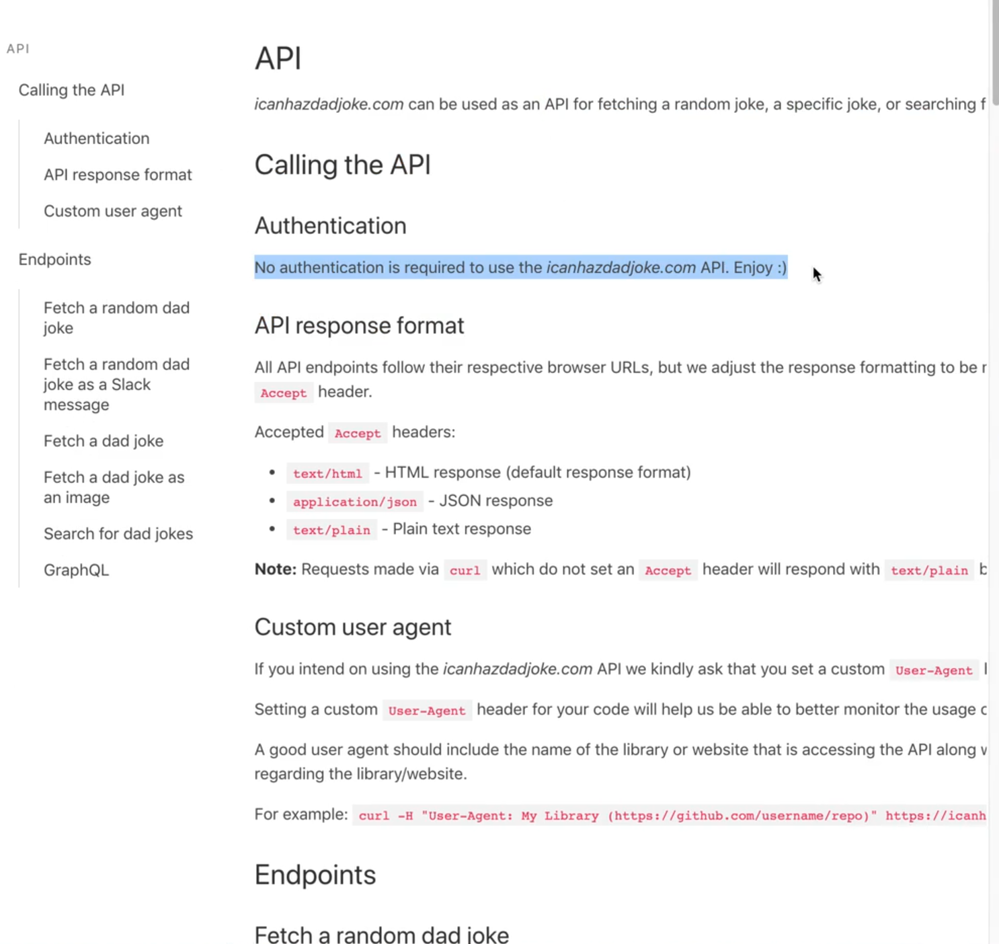 2:04

No authentication is required. There is this one note however..

> All API endpoints follow their respective browser URLs, but we adjust the response formatting to be more suited for an API based on the provided HTTP Accept header.

What that means is we can get the joke back as HTML, JSON or plain text. That is interesting because the endpoint is going to be the same for everybody, but depending on what we pass, it will return different values to us.

Let's start by writing the function that will fetch the joke. We will fetch the joke using the endpoint, and then just log the response for now. We will then call `fetchJoke` on runtime. 👇

```js
const jokeButton = document.querySelector(".getJoke");
const jokeHolder = document.querySelector(".joke");

const buttonText = [
  "Ugh.",
  "🤦🏻‍♂️",
  "omg dad.",
  "you are the worst",
  "seriously",
  "stop it.",
  "please stop",
  "that was the worst one",
];

async function fetchJoke() {
  const response = await fetch("https://icanhazdadjoke.com");
  console.log(response);
}

fetchJoke();
```

If you refresh the page, you should see the response is something similar to what you see below.

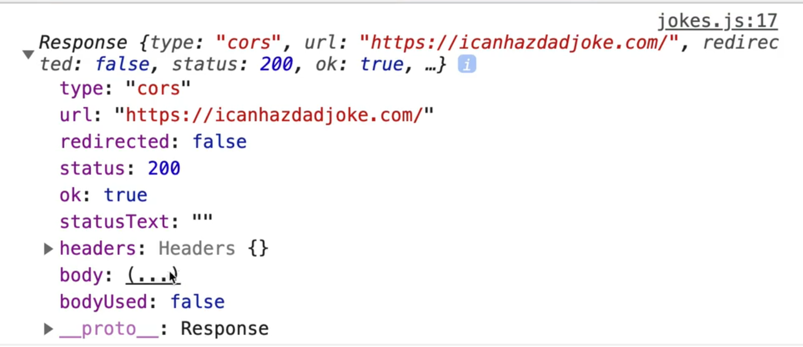 3:38

### Headers

Now we need to turn that stream into something that is human readable. Let's try to do `response.json()` like we have used in the past and log that. 👇

```js
const joke = response.json();
console.log(joke);
```

However, if you try that, you will see an error like the following:

> Uncaught (in promise) SyntaxError: Unexpected token < in JSON at position 0

What that errors means is that you have most likely been returned some HTML (since it returned an open angle bracket `<`) and while it is trying to parse that, JSON it is complaining.

The way we can check for that is to go to the network tab and find the actual request and click through it, you will see that the response is just an HTML document that came back.

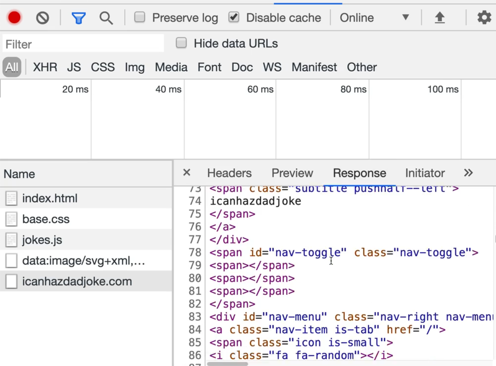 4:36

Not all websites allow you to fetch HTML but since this API has a CORS policy setup, we are able to do it.

So the API is telling us we need to pass an **Accept Header** which is either:

- text/html (this is what we just saw)
- application/json
- text/plain

We need to pass that option along a header.

What is a **header**?

A header is some additional information that comes along with a request, kind of like when we pass query parameters, but headers are passed in a different way.

If you look at our dad joke API fetch request in the network tab and click it, you can click the headers tab and see the headers that were passed along with the request, and the ones that were passed along with the response.

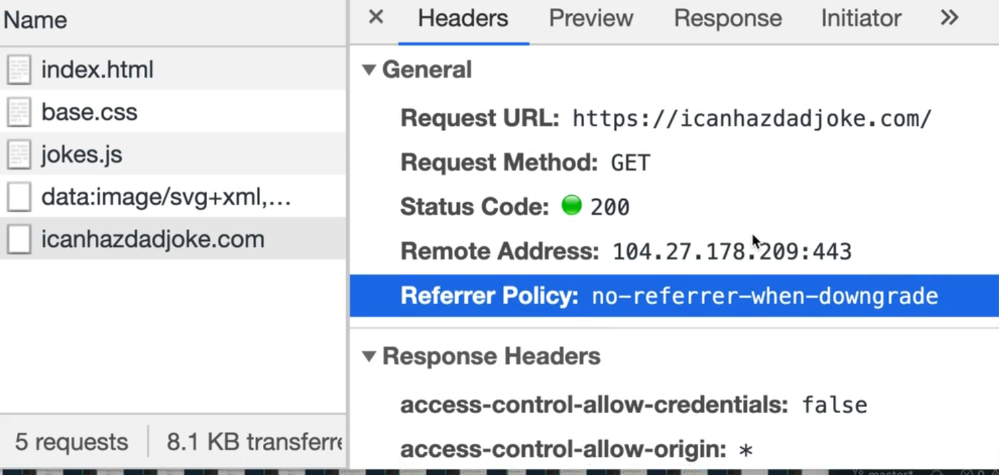 5:33

We need to pass along this additional information with `fetch`. The way you do that is you pass a second object to fetch, which can take in a whole bunch of different arguments. 👇

```js
const response = await fetch("http://icanhazdadjoke.com", {
  headers: {},
});
const joke = response.json();
console.log(joke);
```

The documentation said the API requires an **Accept Header** so let's go ahead and add that.

```js
const response = await fetch("http://icanhazdadjoke.com", {
  headers: {
    Accept: "application/json",
  },
});
```

If you refresh the page now, you will see a promise.

 6:13

That is because we forgot to await the response. Modify the code like so:

```js
const joke = await response.json();
console.log(joke);
```

Now what comes back is the actual data.

 6:40

```js
const response = await fetch("http://icanhazdadjoke.com", {
  headers: {
    Accept: "application/json",
    Accept: "text/plain",
  },
});
```

 6:59

Now if we change that to text/plain (it is fine to have two, the one further down will overwrite the earlier ones, we will a similar error about unexpected token W). If you look at the response, it says "Unexpected W" because it returned to us text and our application was expecting JSON.

This shows us that we can accept HTML, plain text or JSON, not because we changed the accept headers, but because we are sending a request to a server that offers up those three kinds of response formats.

Change the format back to json and return it from the `fetchJokes` function.

```js
async function fetchJoke() {
  const response = await fetch("http://icanhazdadjoke.com", {
    headers: {
      Accept: "application/json",
    },
  });

  const data = response.json();
  return data;
}
```

Similarly, you could also just return `response.json()` directly.

```js
async function fetchJoke() {
  const response = await fetch("http://icanhazdadjoke.com", {
    headers: {
      Accept: "application/json",
    },
  });

  return response.json();
}
```

That still works because we are in an async function so we will just be awaiting the fetch joke either way.

Wes prefers to do it the way we originally coded it so that if we needed to log the response, it's as easy as adding a log.

Next we want to wire up the button so that when someone clicks it, we will fetch a joke.

Get rid of our call to `fetchJoke` on runtime and instead let's make an async function called `handleClick` which will be responsible for fetching a joke.

```js
async function handleClick() {
  const { joke } = await fetchJoke();
  console.log(joke);
}
```

The reason we are using destructuring is that `fetchJoke` will return an object to us with properties of `id`, `joke` and `status`. We only want the joke property for now so we are destructuring the joke property to it's own variable.

Next add an event listener for the click event, and pass it the `handleClick` function to run on the event.

```js
jokeButton.addEventListener("click", handleClick);
```

Now when you refresh the page and open the console, you will see that every time we click the button, a new joke is logged.

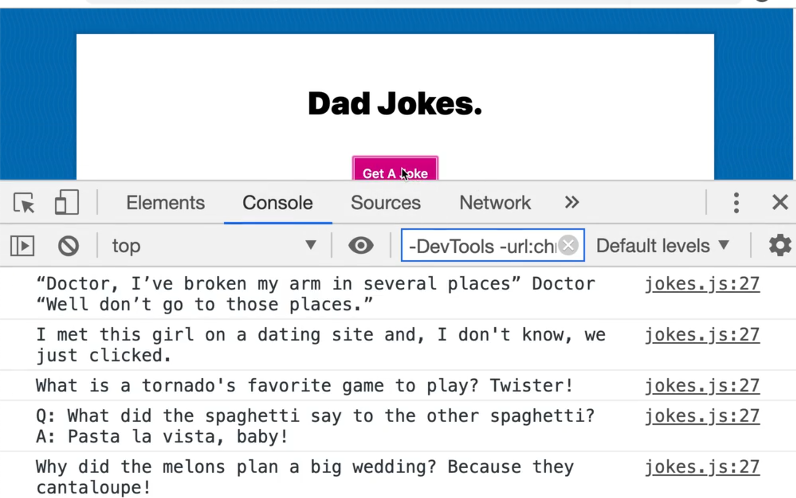 9:29

Now within`handleClick`, take the `jokeHolder` and set it's `textContent` to be the joke 👇

```js
async function handleClick() {
  const { joke } = await fetchJoke();
  jokeHolder.textContent = joke;
}
```

When the button is clicked now, the joke should populate and change within the paragraph tag.

 9:48

Next we want to take the button text and replace it with one of the strings in the `buttonText` array shown below.👇

```js
const buttonText = [
  "Ugh.",
  "🤦🏻‍♂️",
  "omg dad.",
  "you are the worst",
  "seriously",
  "stop it.",
  "please stop",
  "that was the worst one",
];
```

To do that, call the function `getItemFromArray`, which will accept two arguments:

- the array
- then what to not be (we will implement that second param in a sec).

### Getting a Random Index

If the array is 5 items long, then to find a random index between 0 - 4 we can use `Math.random() * 5`.

```js
function randomItemFromArray(arr, not) {
  const item = arr[Math.floor(Math.random() * arr.length)];
  return item;
}
```

The reason we are using the passed in array to calculate the length and not the `buttonText` variable is that we want this function to be a utility function, and to be able to use them for anything, not just with the `buttonText` array. This allows it to be more generic.

Let's try to run it from the console.

Refresh the HTML page and pass the `buttonText` array to the function we just created.👇

```js
randomItemFromArray(buttonText);
```

Now whenever we run it, we get a random item returned.

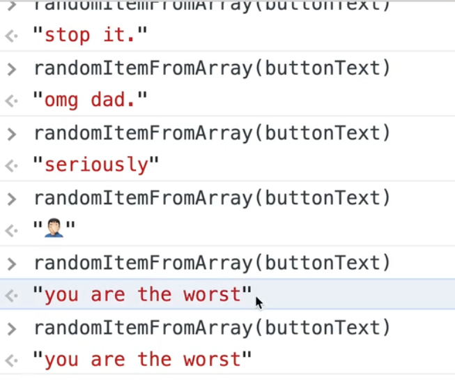 12:10

However, sometimes it will randomly return the exact same thing, which makes it seem like nothing happened.

That is why we have that `not` parameter that we are passing. Within the `randomItemFromArray` function, we will use that `not` parameter to ensure the same text isn't selected twice.

To do that, we will add a check for whether the randomly selected item matches the `not` argument, and if it does, we will call the function again. That is an example of **recursion** because the function is calling itself.

```js
if (item == not) {
  console.log("Ah! we used that one last time, look again");
  return randomItemFromArray(arr, not);
}
```

It is possible that this code will run a few times and call itself before it finds one that is not the same.

Let's try running it in the console but this time passing the `not` parameter.

! 13:37

As you can see, when we got "please stop", we logged "Ah we used that one last time look again" to the console and the method called itself again and the next time it returned different text.

So now we can do the following.. 👇

```js
async function handleClick() {
  const { joke } = await fetchJoke();
  jokeHolder.textContent = joke;
  jokeButton.textContent = randomitemFromArray(
    buttonText,
    jokeButton.textContent
  );
}
```

We are ensuring that the button text never stays the same using this line of code `jokeButton.textContent = randomitemFromArray(buttonText, jokeButton.textContent);`. We get the "not" argument from the text that currently exists on the button when it is clicked.

If you refresh the page, you will see it is working very well, and if you just keep clicking it, eventually we will get a log that states "we already used that one".

### Loading State & CSS Loader

This is working, but one thing we are going to do is add a loading state. Feel free to leave this lesson now if you are not interested in loaders.

Let's make a CSS loader.

In the HTML, right before our paragraph tag that will contain our dad jokes, add the following div `<div class="loader"></div>`.

LGoogle "CSS loader" and select `loading.io`.

 15:39
 15:43

Click on whatever loader you would like to move and it should show you the markup you need to add to the page.

 15:50

Then let's actually replace the div we just added with the HTML supplied to us for the loader.

```html
<div class="wrapper">
  <div class="joke">
    <div class="lds-ripple">
      <div></div>
      <div></div>
    </div>
    <p>Dad Jokes.</p>
  </div>
  <button class="getJoke">
    <span class="jokeText">Get A Joke</span>
  </button>
</div>
```

Copy the CSS and add it.

```css
.lds-ripple {
  display: inline-block;
  position: relative;

  width: 80px;
  height: 80px;
}

.lds-ripple div {
  position: absolute;
  border: 4px solid white;
  opacity: 1;
  border-radius: 50%;
  animation: lds-ripple 1s cubic-bezier(0, 0.2, 0.8, 1) infinite;
}

.lds-ripple div:nth-child(2) {
  animation-delay: -0.5s;
}

@keyframes lds-ripple {
  0% {
    top: 36px;
    left: 36px;
    width: 0;
    height: 0;
    opacity: 1;
  }

  100% {
    top: 0px;
    left: 0px;
    width: 72px;
    height: 72px;
    opacity: 0;
  }
}
```

If you refresh the page, you will notice we don't see anything.

Let's inspect the element and see what is going on.

If you look at the styles, you will notice the loader is set to the colour white. Let's fix that.👇

```css
.lds-ripple div {
  position: absolute;
  border: 4px solid var(--yellow);
  opacity: 1;
  border-radius: 50%;
  animation: lds-ripple 1s cubic-bezier(0, 0.2, 0.8, 1) infinite;
}
```

 17:13

Now you can see the loader, it was always working, it was just white so we could not see it.

Add a class of "loader" to the loader on top of the existing `lds-ripple` class.

```HTML
<div class="lds-ripple loader">
```

At the top of the script, select the loader.

```js
const loader = document.querySelector(".loader");
```

When we fetch within the `fetchJoke` function, let's turn the loader on. By default we will make the loader set to `display:none`.

To do that, create a class of `hidden` and set it to `display:none;` and then add that class to our loader like so: 👇

```HTML
<div class="lds-ripple loader hidden">
```

Now when we want to turn the loader on, we will call 👇

```js
loader.classList.remove("hidden");
```

When the data comes back, we want to turn it off using 👇

```js
loader.classList.add("hidden");
```

Modify the code like so 👇

```js
async function fetchJoke() {
  loader.classList.remove("hidden");
  const response = await fetch("http://icanhazdadjoke.com", {
    headers: {
      Accept: "application/json",
    },
  });

  const data = response.json();
  loader.classList.add("hidden");
  return data;
}
```

Also hide the button while that is happening.

```js
async function fetchJoke() {
  loader.classList.remove("hidden");
  jokeButton.classList.remove("hidden");
  const response = await fetch("http://icanhazdadjoke.com", {
    headers: {
      Accept: "application/json",
    },
  });

  const data = response.json();
  loader.classList.add("hidden");
  jokeButton.classList.remove("hidden");
  return data;
}
```

 19:14

However, that looks a bit jarring.

Let's try to put the loader inside of the button instead.

```html
<button class="getJoke">
  <span class="jokeText"
    >Get A Joke
    <div class="lds-ripple loader">
      <div></div>
      <div></div>
    </div>
  </span>
</button>
```

 19:54

It is showing up because we removed the class of `hidden` from the HTML. Modify the CSS to make the loader white again.

```csss
  border: 4px solid var(--yellow);
```

 20:00

Let's also change the size.

We will make a size variable and set it to `20px` and then modify some of the other CSS to use that variable instead.

```html
<style>
  html {
    --size: 20px;
  }

  .wrapper {
    text-align: center;
  }

  .joke {
    font-size: 5rem;
    font-weight: 900;
  }

  .lds-ripple {
    display: inline-block;
    position: relative;

    width: var(--size);
    height: var(--size);
  }

  .lds-ripple div {
    position: absolute;
    border: 4px solid var(--yellow);
    opacity: 1;
    border-radius: 50%;
    animation: lds-ripple 1s cubic-bezier(0, 0.2, 0.8, 1) infinite;
  }

  .lds-ripple div:nth-child(2) {
    animation-delay: -0.5s;
  }

  @keyframes lds-ripple {
    0% {
      top: calc(var(--size) / 2);
      left: calc(var(--size) / 2);
      width: 0;
      height: 0;
      opacity: 1;
    }

    100% {
      top: 0px;
      left: 0px;
      width: calc(var(--size) * 0.9);
      height: calc(var(--size) * 0.9);
      opacity: 0;
    }
  }

  .hidden {
    display: none;
  }
</style>
```

 21:36

As you can see above, it is working although it doesn't look great. Our sizing was a bit off.

Let's put the loader back to hidden on page load by adding back that class.

Now we need to modify our buttons to not hide it anymore, so remove that code from `fetchJoke`.

```js
async function fetchJoke() {
  loader.classList.remove("hidden");
  const response = await fetch("http://icanhazdadjoke.com", {
    headers: {
      Accept: "application/json",
    },
  });

  const data = response.json();
  loader.classList.add("hidden");
  return data;
}
```

If you refresh the page and try that now, it will work the first time but not the second time because we overwrite the loader with the text this time.

What we need to do is grab the `span` element within the joke button so we only replace that portion of the button, instead of the entire button.

At the top of the file add `jokeButtonSpan` like so:

```js
const jokeButton = document.querySelector(".getJoke");
const jokeButtonSpan = jokeButton.querySelector(".jokeText");
```

Let's find where in our code we are updating the button text and instead update the `jokeButtonSpan` instead. 👇

```js
async function handleClick() {
  const { joke } = await fetchJoke();
  jokeHolder.textContent = joke;
  jokeButtonSpan.textContent = randomItemFromArray(
    buttonText,
    jokeButtonSpan.textContent
  );
}
```

That works! Let's move onto the next lesson.

---

## 77 - Currency Converter

In this video we will build a currency conversion app.

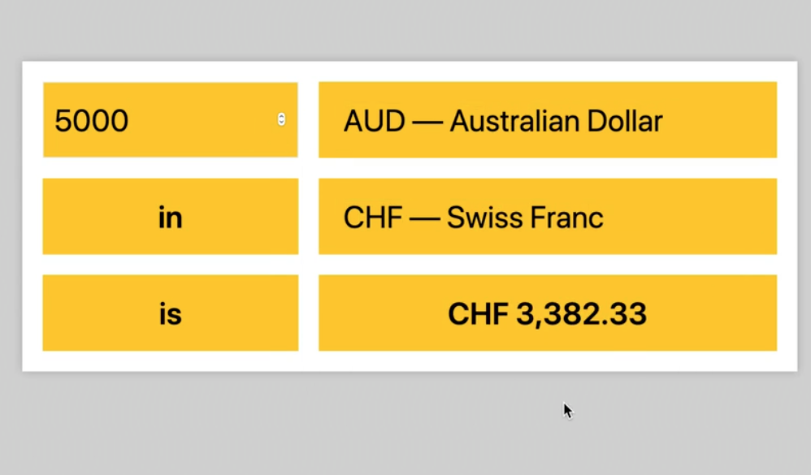 00:16

The app allows you to enter an amount to convert, specify it's currency and then specify which currency to convert it to.

We will be using the https://exchangeratesapi.io API to accomplish this, which is free and open source and will be working out of the `exercises/77 - Currency Converter/` folder.

Let's start by opening the HTML to see what we are working with.

```html
<body>
  <div class="app">
    <form>
      <input type="number" name="from_amount" />
      <select name="from_currency">
        <option>Select a Currency</option>
      </select>
      <p>in</p>
      <select name="to_currency">
        <option>Select a Currency</option>
      </select>
      <p>is</p>
      <p class="to_amount">$0</p>
    </form>
  </div>
  <script src="./money.js"></script>
</body>
```

As you can see we have a form with..

- an input named `from_amount`
- a selectbox named `from_currency` and one named `to_currency`
- a paragraph tag with the class of `to_amount`

You will notice there are no options currently for the `from` or the `to` currency, because that will be populated on page load.

We have a script source tag right before the closing body tag.

If you open up `money.js`, you will see that Wes has already given us just a list of currencies, which is the currency code translated to their English version.

 2:09

Let's start by converting those currencies so we can populate them.

In `money.js`, after the `currencies` object, make a function called `generateOptions` which will accept one parameter, `options`, which will be an object.

Add the following code so it runs on page load and refresh the page.

```js
const optionsHTML = generateOptions(currencies);
console.log(optionsHTML);
```

 3:26

Let's go back to looping. How do you loop over an object?

We can use:

- the `for of` loop
- `Object.entries`
- `Object.keys`
- `Object.values`

Let's use `.entries` to turn this object into an array, like so 👇

```js
function generateOptions(options) {
  return Object.entries(options);
}
```

If you refresh the page, you will see that gives us an array, where each item inside of the array is another array, the first time of which is the currency code and the second item being the label.

 4:09

Let's take that array and map over it so we get the nested array, and then log it. 👇

```js
function generateOptions(options) {
  return Object.entries(options).map((arr) => {
    console.log(arr);
  });
}
```

 4:37

We can destructure each sub-array to two variables:

- `currencyCode`
- `currencyName`

```js
function generateOptions(options) {
  return Object.entries(options).map(([currencyCode, currencyName]) => {
    console.log(currencyCode, currencyName);
  });
}
```

 4:58

As you can see, it is looking good, except the array is undefined because we are not returning anything, so let's change that and return some HTML using backticks.

```js
function generateOptions(options) {
  return Object.entries(options).map(([currencyCode, currencyName]) => {
    return `<option value="${currencyCode}">${currencyCode} - ${currencyName}</option>`;
  });
}
```

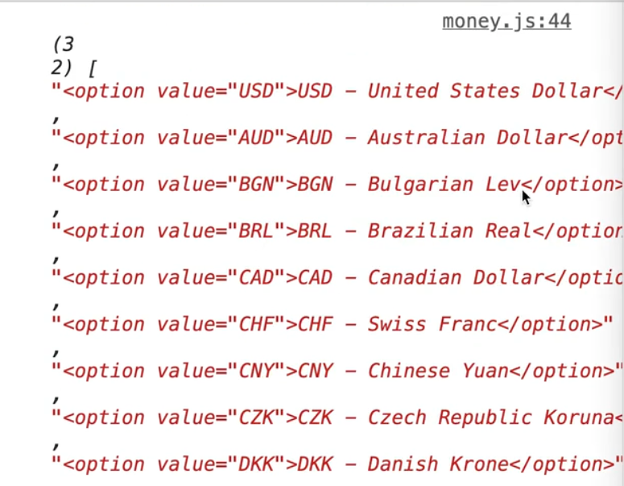 5:\$3

Now the `optionsHTML` variable contains an array of HTML options.

At the end of `map`, add `.join('')`, which should turn the array into one long string of HTML. 👇

```js
function generateOptions(options) {
  return Object.entries(options)
    .map(
      ([currencyCode, currencyName]) =>
        `<option value="${currencyCode}">${currencyCode} - ${currencyName}</option>`
    )
    .join("");
}
```

On page load, let's populate the option elements.

First go to the top of the page and select those elements.👇

```js
const fromSelect = document.querySelector('[name="from_currency"]');
const fromInput = document.querySelector('[name="from_amount"]');
```

At the bottom of the page, add the following code.

```js
const optionsHTML = generateOptions(currencies);
// populate the options elements
fromSelect.innerHTML = optionsHTML;
toSelect.innerHTML = optionsHTML;
```

We are populating both options with the exact same list. That is why we put `optionsHTML` in a variable, so that we would not unnecessarily run that function twice.

Now when you refresh, you will see that each option has a dropdown. 👇

 7:10

Let's switch to working on some of the functionality before we continue coding the UI any further.

Start with the function that will go fetch the rates from the exchanges API. It will accept one parameter, `base` which we will default to "USD" as the base currency.

Inside of the function, we need to fetch the latest rates from https://api.exchangeratesapi.io/latest.

Stick that endpoint in a variable at the top.

```js
const endpoint = "https://api.exchangeratesapi.io/latest";
```

The way this endpoint works is we need to pass it a query parameter of our base currency, as shown in the image below.

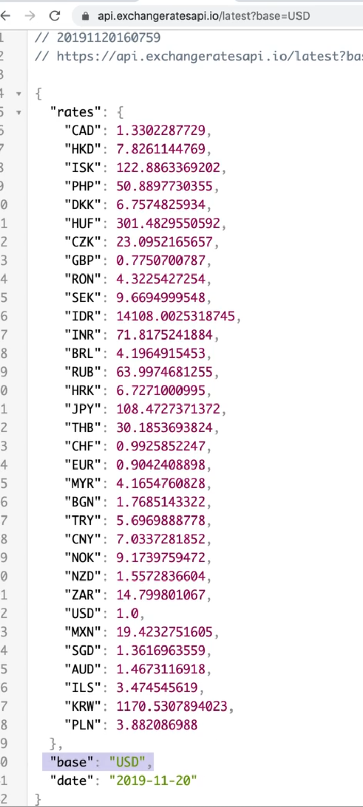 8:38

That will return the exchange rates to us as well as the base currency.

```js
async function fetchRates(base = "USD") {
  const res = await fetch(`${endpoint}?base=${base}`);
  const rates = await res.json();
  console.log(rates);
}
```

If you open the browser and try to run `fetchRates()` from the console, it will return to us a promise immediately because it is an async function, and then it will resolve and log our rates.

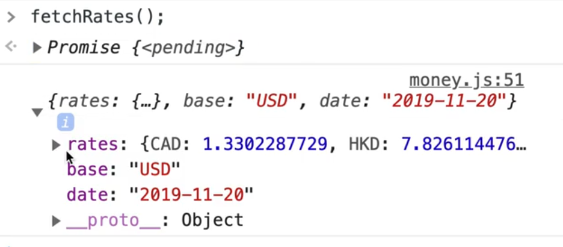 9:53

You can try passing the base currency as "CAD" and it should still work.

 10:04

Let's wrap that function up by returning `rates` from it.

```js
async function fetchRates(base = "USD") {
  const res = await fetch(`${endpoint}?base=${base}`);
  const rates = await res.json();
  return rates;
}
```

The next thing that we want to do is make a convert function. The function will take in:

- a raw number
- a "from" currency
- a "to" currency

If we do not have the rates for that specific currency, we will have to use `fetchRates` to go ahead and fetch it.

Make that `convert` function like so 👇

```js
function convert(amount, from, to) {
  //first check if we even have the rates to convert from that currency
}
```

### Caching the Rates

Here is where that exercise gets a little tricky.

We could fetch the rates each time, but that could be a bit slow, because every time we type into the `amount` input box, we will call `convert` function.

In the demo, you can see that the conversion is happening almost instantaneously.

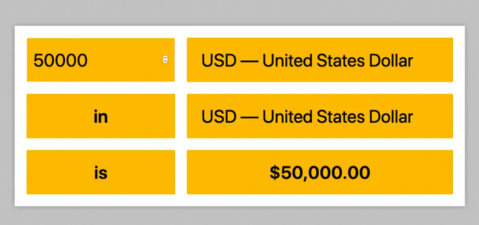 11:22

If we had to fetch the rates every single time someone typed into the box, for the number 57887 alone, we would be fetch the rate 5 times unnecessarily, and often APIs will rate limit you.

So what we need to do to get around that is cache the rates, meaning you need to hold on to them, if you already have them. There are different techniques you can do like delete rates every minute to ensure we have the latest data.

What we are going to do is we will make an object at the top of our script where the rest of our variables are and right below the endpoint let's add this empty object 👇

```js
const ratesByBase = {};
```

We will store all of the rates within that object/ Every time a currency is selected to be converted, we will check whether we already have the rates within our `ratesByBase` object. If we do not, we will fetch it and save it to our object.

 12:59

If we were to cycle through all the currencies, our `ratesByBase` object would be massive because it will contain all of the rates by their from value. So by default we start with nothing because we have nothing.

### Converting

Let's go back to our `convert` function.

We will use the square brackets to check if the currently select currency coded already existing within our object.

```js
function convert(amount, from, to){
  //first check if we even have the rates to convert from that currency
  if(!ratesByBase[from]){
    console.log(`Oh no! we don't have ${from} to convert it ${to}, so let's go get it!`);
  }
}
```

If you refresh the page, you can try running what we have so far from the console.

 14:16

Back to our `convert` function, we want to mark it as `async` because we will need to fetch the rate if it does not already exist.

Within that function let's add a request to `fetchRates` and pass it the currency the user is converting from. We will save the result to our `ratesByBase` object.

```js
async function convert(amount, from, to){
  //first check if we even have the rates to convert from that currency
  if(!ratesByBase[from]){
    console.log(`Oh no! we don't have ${from} to convert it ${to}, so let's go get it!`);
    const rates = await fetchRates(from);
    console.log(rates);
    //store them for next time
    ratesByBase[from] = rates;
  }
}
```

Let's demo step by step how that works.

 Start by logging `ratesByBase` in the console, which you will see is an empty object.

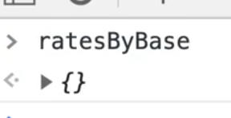 15:11

If we run `convert(100, 'CAD', 'USD")` in the console, we will see the message stating we don't have it but are fetching it.

Now if we check the `ratesByBase` object, we will see those rate values within the object. If you were to run the same convert function again, you will see it does not refetch them because the values already exist within `ratesByBase`.

 15:34

As soon as you refresh the page, they will be gone. You could use local storage to save those but we will just do page load for this exercise.

Next, we need to convert the amount the user passed in.

```js
function convert(amount, from, to){
  //first check if we even have the rates to convert from that currency
  if(!ratesByBase[from]){
    console.log(`Oh no! we don't have ${from} to convert it ${to}, so let's go get it!`);
    const rates = await fetchRates(from);
    console.log(rates);
    //store them for next time
    ratesByBase[from] = rates;
  }
  const rate = ratesByBase[from].rates[to];
}

```

That may look weird so let's explain what is going on in this code.

```js
const rate = ratesByBase[from].rates[to];
```

If we look at our `CAD` property on `ratesByBase`, that is going to be our "from" .

Inside of that, we need to grab the rates and the find the rate that they are converting to. You could do that like so: `ratesByBase.CAD.rates.USD`.

But because those property keys are variables within our function, we need to use square brackets to access those object properties.

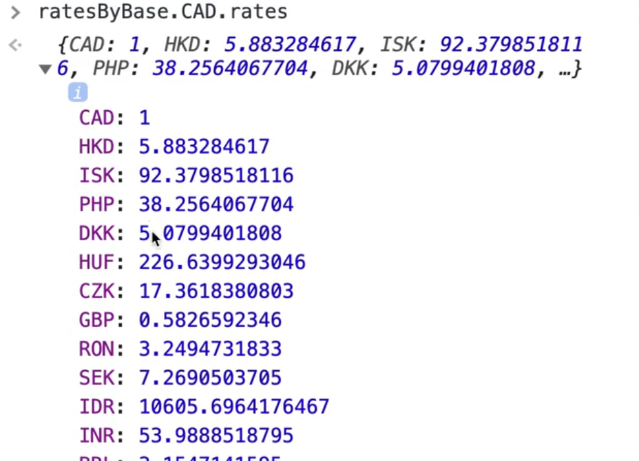 16:36

Now we will take that `rate` and calculate the `convertedAmount` like so 👇

```ja
function convert(amount, from, to){
  //first check if we even have the rates to convert from that currency
  if(!ratesByBase[from]){
    console.log(`Oh no! we don't have ${from} to convert it ${to}, so let's go get it!`);
    const rates = await fetchRates(from);
    console.log(rates);
    //store them for next time
    ratesByBase[from] = rates;
  }
  const rate = ratesByBase[from].rates[to];
  const convertedAmount = rate * amount;
  console.log(`${amount} ${from} is ${convertedAmount} in ${to}`);
  return convertedAmount;
}
```

If you refresh the page and try that, you should see something like the following..

 18:01

At this point, we have built the main functionality of the app so at this point we can start hooking it up to our UI.

### Hooking Up The UI

There are three inputs that we need to listen on:
- the amount,
- 2 currency select inputs

#### Input Event on a Form

There is a trick we can use here, which is listening for an input event on the form. That one event will cover all of them, which is pretty cool.

Let's go up to the top of our script file and select the form.

```js
const form = document.querySelector('.app form');
```

At the very bottom of the script tag, add an event listener which will listen for the `input` event and handle it in a function we will define called `handleInput`, like so 👇

```js
form.addEventListener('input', handleInput);
```

Let's define that `handleInput` function, and for now just log `e.target` and `e.currentTarget` to see what we are working with.

```js
function handleInput(e){
  console.log(e.target);
  console.log(e.currentTarget);
}
```

 20:26

If you refresh the page and try typing into the amount input or selecting an item from the drop downs, you will see that `e.target` is changing every time but `e.currentTarget` which is the form stays the same.

That is because we are listening to the event on the form, but the actual event happens on the input or select box.

Those events bubble up to the form where we handle them in our `handleInputs`.

So remember that trick, you can listen on the "input" event on a form and that will cover all of your inputs that are inside of that form.

#### Wiring up Handlers

Let's start wiring up the handler to call our functions.

We forgot to grab our "amount" input, so let's go ahead to the top of the page and add that.

```js
const fromSelect = document.querySelector('[name="from_currency"]');
const toSelect = document.querySelector('[name="to_currency"]');
const fromInput = document.querySelector('[name="from_amount"]');
```

Now let's make `handleInput` an async function so we can call `convert`. We can pass the variables easily using the value of the three inputs like so 👇

```js
async function handleInput(e){
  const rawAmount = await convert(
    fromInput.value,
    fromSelect.value,
    toSelect.value
  );
  console.log(rawAmount);
}
```

 22:44

If you refresh the page and try entering an amount into the "from_amount" input, you should see something like shown above 👆 logged in the console.

Now we need to actually show that amount in the `to_amount` paragraph tag.


 23:00

Let's go back to the top of our page and select that element and name it `toEl`.

```js
const fromSelect = document.querySelector('[name="from_currency"]');
const toSelect = document.querySelector('[name="to_currency"]');
const fromInput = document.querySelector('[name="from_amount"]');
const toEl = document.querySelector('.to_amount');
```

Now within `handleInput`, let's update the element to show the converted amount. 👇

```js
async function handleInput(e){
  const rawAmount = await convert(
    fromInput.value,
    fromSelect.value,
    toSelect.value
  );
  toEl.textContent = rawAmount;
}
```

If you refresh the page and test it out, you should see the `to_amount` value updating.

Try changing the "to currency" and the "from currency" to ensure the value is still updating.

 23:56

#### Formatting Currency using Number Format API

The problem we have now is that it is not formatting it accordingly to what the locale is.

Money is New Zealand Dollars (NZD), or money in Indian Rupee (INR), may be formatted differently. Some currencies support cents, some do not.

We will use this really cool API called Number Format, and it knows how to handle currency formatting, which is really cool.

Make a function `formatCurrency` which will take in the amount and the currency and return a formatted number.

We will be using the `Intl.NumberFormat()` method which takes in an argument of the language of the reader `Intl.NumberFormat("en-us")`, or if you leave it blank it will detect the language based no the browser, which is almost always what you want.

We will leave it blank.

And as the second argument you pass it an options object.

Within that object we will pass a value for the `style` property which will be `'currency'`, since we want to format the amount as a currency, and then we need to pass the currency argument which we can do using the shorthand since both the property and value have identical names.

 26:08

The code highlighted above is the "formatter", and then the method is just a `.format()` method on the formatted to which you pass your amount like so:

```js
function formatCurrency(amount, currency){
  return Int1.NumberFormat({
    style:'currency',
    currency
  }).format(amount);
}
```

So now instead of just setting the `toEl` value to `rawAmount` we will modify it like so:

```js
async function handleInput(e){
  const rawAmount = await convert(
    fromInput.value,
    fromSelect.value,
    toSelect.value
  );
  toEl.textContent = formatCurrency(rawAmount, toSelect.value);
}
```

Refresh the page and check whether that works.

 26:44

Unfortunately that does not seem to be working. Let's look at the console to debug.

When Wes runs into a problem like this, when there are many things calling each other, he just works on them one by one.

Lets start by testing `formatCurrency` in the console.

 27:20

We do not get the formatted amount back. Try manually passing the locale to `Intl.NumberFormat` method.

Modify the code like below to include it.

```js
function formatCurrency(amount, currency){
  return Int1.NumberFormat("en-US", {
    style:'currency',
    currency
  }).format(amount);
}
```

Now if you refresh it, it should be working.

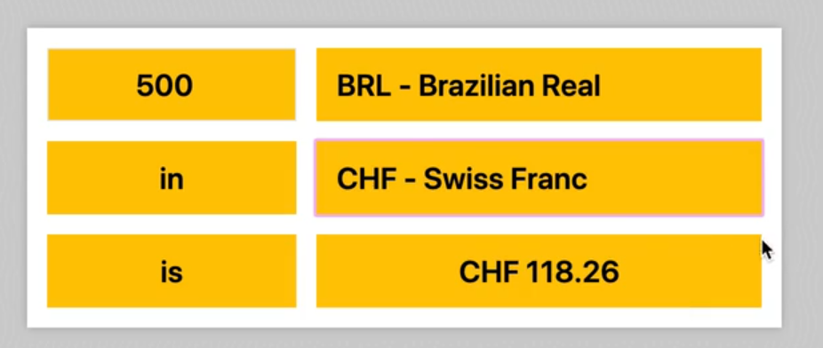 27:47
