- [Module 1: The Basics](#module-1--the-basics)
  * [01 - Welcome](#01---welcome)
    + [House Keeping](#house-keeping)
      - [Starter Files](#starter-files)
        * [Slack Channel](#slack-channel)
        * [Structure of Starter files](#structure-of-starter-files)
      - [How to Do the Course](#how-to-do-the-course)
  * [02 - Browser, Editor and Terminal Setup](#02---browser--editor-and-terminal-setup)
    + [The browser](#the-browser)
      - [Shortcuts](#shortcuts)
    + [NodeJS](#nodejs)
      - [Checking if it's installed](#checking-if-it-s-installed)
      - [Which Terminal to Use](#which-terminal-to-use)
      - [Checking if you have npm installed](#checking-if-you-have-npm-installed)
    + [Command Line Basics](#command-line-basics)
    + [Check that Node is working](#check-that-node-is-working)
    + [Code Editor](#code-editor)
  * [03 - Running and Loading JS](#03---running-and-loading-js)
    + [Run scripts before closing body tag](#run-scripts-before-closing-body-tag)
    + [External JavaScript Files](#external-javascript-files)
    + [Running it in NodeJS](#running-it-in-nodejs)
  * [04 - Variables and Statements](#04---variables-and-statements)
    + [var](#var)
    + [let](#let)
    + [const](#const)
    + [Statements and Semi Colons Semi-Colons in JavaScript](#statements-and-semi-colons-semi-colons-in-javascript)
    + [Code Blocks](#code-blocks)
    + [Differences between var, let & const](#differences-between-var--let---const)
      - [Strict Mode](#strict-mode)
      - [Scoping](#scoping)
      - [Naming Conventions](#naming-conventions)
      - [Camel Casing](#camel-casing)
    + [Snake Case](#snake-case)
    + [Kebab Case - Not Allowed](#kebab-case---not-allowed)
  * [05 - Code Quality Tooling with Prettier and ESLint](#05---code-quality-tooling-with-prettier-and-eslint)
    + [ESLint & Prettier](#eslint---prettier)
      - [ESLint](#eslint)
      - [Prettier](#prettier)
    + [Installing ESLint & Prettier](#installing-eslint---prettier)
    + [Installing npm packages locally](#installing-npm-packages-locally)
    + [Creating the Package.json](#creating-the-packagejson)
  * [06 - Types - Introduction](#06---types---introduction)
  * [07 - Types - Strings](#07---types---strings)
    + [JavaScript Comments](#javascript-comments)
    + [Difference between Single Quotes, Double Quotes and Backticks](#difference-between-single-quotes--double-quotes-and-backticks)
      - [Putting String on Multiple Lines](#putting-string-on-multiple-lines)
    + [Concatenation and Interpolation](#concatenation-and-interpolation)
    + [Backticks](#backticks)
  * [08 - Types - Numbers](#08---types---numbers)
    + [Numbers in JavaScript](#numbers-in-javascript)
    + [Helper Methods](#helper-methods)
    + [Modulo and Power Operators](#modulo-and-power-operators)
    + [Things to know about Math in JavaScript](#things-to-know-about-math-in-javascript)
      - [Infinity and Negative Infinity](#infinity-and-negative-infinity)
      - [Not a Number](#not-a-number)
  * [09 - Types - Objects](#09---types---objects)
  * [10 - Types - Null and Undefined](#10---types---null-and-undefined)
    + [undefined](#undefined)
    + [null](#null)
  * [11 - Types - Booleans and Equality](#11---types---booleans-and-equality)
    + [Equality (equal sign, double equal sign, triple equal sign)](#equality--equal-sign--double-equal-sign--triple-equal-sign-)

---

# Module 1: The Basics

---

## 01 - Welcome

Welcome.

This course is all the stuff Wes wishes he had known over the last 10 years of him doing JavaScript. It is a big course but it does a good job of distilling the information down into the things you need to know, and making it easy and fun!

### House Keeping

This video is for housekeeping items that need to be addressed before we can get into writing code.

#### Starter Files

First one is the starter files for this can be found at www.beginnerjavascript.com. Click through to My Account and there will be a link to the starter files.

The starter files link will bring you over to github which has all of the starter files as well as all of the solutions for this course.

**Please star the beginner-JavaScript github repo to help Wes up!**

##### Slack Channel

There is also a link to the slack channel, where you can jump in and get help, maybe join up with a buddy and do a course together with someone.

##### Structure of Starter files

There are 3 folders in the `beginner-JavaScript` repo.

1.  `snippets`
2.  `playground`
3.  `exercises`

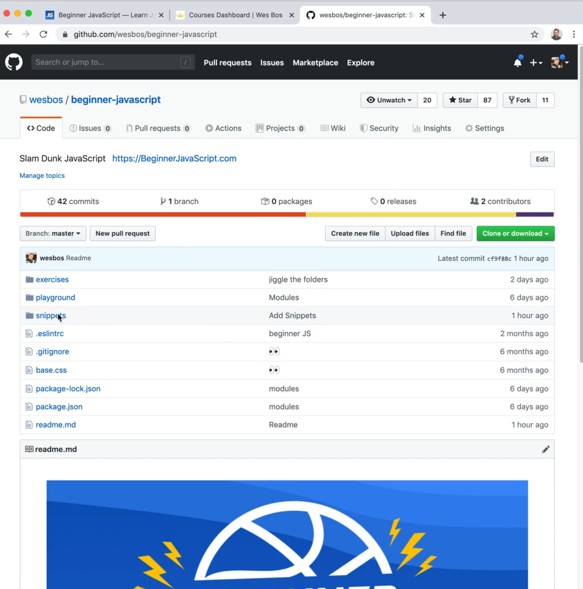

The `snippets` folder that has some base HTML snippets in there with instructions on how to get them into your HTML editor (we will talk about the editor in the next video).

There is also a `/playground` folder, which has some HTML files Wes uses to explain concepts throughout the course. He will often provide a `-FINISHED.html` file, which will include what Wes has written in the video, whereas the file itself, Wes will either ask you to create it yourself or he will provide an empty state.

The `/exercises` folder contains all the proper, full blown exercises that we will be doing throughout the course.

Note: Sometimes the numbers of the exercise folders are going to be a little off from the video number is, so just make sure to line up the file with the name of the video, not necessarily the number.

#### How to Do the Course

Another thing is how should you do this course? Should you watch it, should you code, should you code while you watch?

About half the people prefer to watch it and then do it after, and the other half prefer to do it as they watch.

Try both methods and see what best works for you! You'll fall into whatever feels best for you pretty quickly.

Last thing is grab a buddy if you can.

Jump into the slack chatroom and see if there is anyone willing to do it with you, you can team up, or team up with someone in person. It's always better if there is someone to hold you accountable.

It's a long course, 28 hours long, you can jump around.

If you understand certain concepts, such as what functions or parameters are, feel free to skip those videos.

The whole idea is that it is reference-able.

We are not building a huge app here that be build on in every video, instead, every video pretty much stands on it's own and if we reference something from a previous video, Wes will mention it.

---

## 02 - Browser, Editor and Terminal Setup

Let's talk real quick about setup and the tools you need.

You can skip this video if you know the three things:

1.  Which browser you would like to use (as well as how to open the dev tools)
2.  You already have NodeJS and NPM installed.
3.  You have an editor that you like (such as VSCode).

If you already have those things in place, skip this video and move onto the next one. Wes will just be introducing all three of those and talking about his personal choices behind them.

### The browser

Let's get into the browser.

You can use Firefox, Chrome, any browser you like because we are just writing JavaScript.

The important thing here is that we will be using the developer tools. Both Firefox and Chrome have very good web developer tools. Wes will likely be using Chrome throughout the course.

Things you need to know how to do is open the dev tools.

You can just right click and select "Inspect Element", which will show you the DOM, and you can click over to the console.

#### Shortcuts

It's worth learning the shortcuts to quickly open up developer tools, inspect element and the console. That way you can really quickly open it.

To find the shortcuts, in Chrome you go to _View > Developer_ and then you can see the shortcuts.

In Firefox, you click on the hamburger menu and go to _Web Developer >_ and then you will see the shortcuts for Inspector and Web Console, which is the two we will be using.

### NodeJS

Next up, we need NodeJS. In order to install NodeJS, go to NodeJS.org and install the latest version.

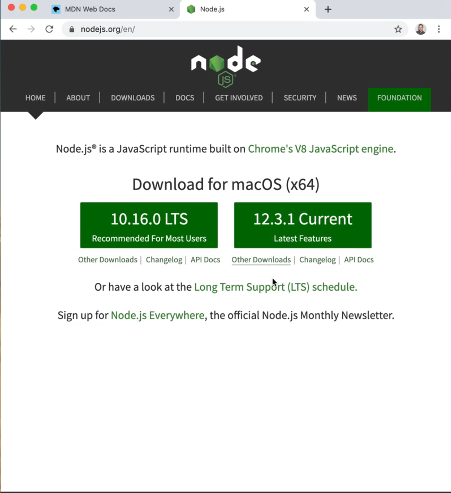

Don't pay attention to the version numbers, those will change depending on when you take the course. _The stuff that we are covering is not dependent on what version of node you use_.

We aren't writing NodeJS websites in this course, instead a lot of tooling, bundling, formatting etc uses NodeJS under the hood so we need to have that installed.

#### Checking if it's installed

How do you know if you have it installed or not?

You can go ahead and install it again and all that will do is update your NodeJS to the current version if you already had it installed.

Another way to check is to open up a terminal window.

#### Which Terminal to Use

You can use the built in terminal application which on a Mac you can find under _Applications > Utilities > Terminal_.

Wes is using a terminal called Hyper for his terminal. You can also use the terminal in VSCode.

You can use iTerm. They are all the same terminal at the end of the day.

If you want to know what theme Wes is using, you can go to https://wesbos.com/uses and that will give you the links to all of the different themes and things he is using.

On Windows, the terminal is called Command Prompt. You can access this by going to _Start > All Programs > Accessories > Command Prompt_. There is another terminal for Windows called Cmder.

How do you know once you have a terminal open?

You can go ahead and type `node - v` in the terminal and press enter.

That will let you know what version you have installed.

#### Checking if you have npm installed

You need to also check that you have NPM installed. You can do that using `npm -v`, which will tell you what version of NPM you have installed.

As long as you have something greater than 10 for node and 6 for npm, you should be fine.

Wes wants to avoid going down any rabbit holes regarding complex tooling and best ways to do things. You just need to have it installed and it will be working.

### Command Line Basics

Now we will do some command line basics in case you are not familiar with working in the command line.

There are a couple of commands you need to know in order to run our JavaScript and bundles.

Cmd Line Basics

`cd` - _this means change directory_
`ls -l` (mac) `dir` (windows) - _this will list out all of the files and directories under the current directory_
`pwd` - _print working directory will give you something like `/Users/wesbos/beginner-JavaScript/exercises`_
`cd ..` - _go up a level in the current directory_

(examples of the above commands visible in image below)👇


In this example, Wes is in the `beginner-JavaScript` directory, and he uses the command `ls -l` to see what other directories he has nested inside his current directory.

He can use the `cd` command to change directories into the `/exercises` directory by typing in `cd exercises`.

_Note: If you want to learn how to customize your terminal, you can go to https://commandlinepoweruser.com to take a quick course of Wes' to get you up and running with a cool terminal that shows the prompt and current working directory like Wes' does. That is not part of this course, just for those who are curious._

Other things to know are going up a level in a directory.
You can do that using `cd ..`

That is all we need to know right now.

### Check that Node is working

If you want to see if your node is working, if you just type `node` that will give you a caret which will oad up a **REPL** which is a **read-eval-print loop**. That is essentially the console. You can do 1+1 and press enter and the console will evaluate that to 2.

Once you have run the `node command`, to get back to the terminal you have to press CTRL + C a few times.

Other helpful things are:

`cmd + k` or `cmd + r` (mac) or `ctrl + k` or `ctrl + r` (windows) -_ will clear out the console. (this works in Chrome dev tools console as well)_

### Code Editor

Finally we are on the topic of the editor.

Wes highly recommends you use VSCode because he thinks it's the best editor for writing JavaScript in.

You may have different opinions.

In terms of tooling, Wes feels that VSCode is the best.

We will be looking at some extensions to use to format JavaScript properly. Again if you want to know what theme Wes is using, refer to https://wesbos.com/uses.

---

## 03 - Running and Loading JS

Let's talk about how to actually run JavaScript.

There are a couple of ways we can run JavaScript:

- in the console
- in node
- via a script tag
- we can also have an external script.

We will talk about how we can actually run those.

The simplest is to open up your dev tools and go to your console.

If you want to run some JavaScript to see how it works, like here Wes has typed 1 + 1 and hit enter and the console returned 2.


This right here is a JavaScript console and it's a nice way to quickly noodle on some JavaScript

To see how it works, just pop open a console. The neat thing is if you are on any websites, say https://github.com, the JavaScript that you type into your console runs on the actual page that is loaded and existing.

For example You can type the following to grab all the paragraphs from the github page that you are currently on. 👇

```js
document.querySelectorAll("p");
```


_(Don't worry about what `document.querySelectorAll()` does, we will cover that in a future video)._

The code that runs in your dev tools console is running in the context of the page that is loaded in your browser tab.

The next way to do it is a script tag.

Go into the `/playground` folder and create a new file `running-js.html`.

_Wes has an Emmet extension so he is going to hit `!` and `Tab` to scaffold out some HTML for us._

In the body, we can have a script tag in which we will add `console.log('hey')`.

What that will do is when the HTML is loaded, it's going to say "OH! This is a script tag, I am changing languages from HTML over to JavaScript, and it will run any code inside of the opening and closing script tag as JavaScript.

If you go ahead and open the `running-js.html` file in the browser, and open the console, you will see that it says "hey".


Don't sweat this too much, we will be explaining what `console.log()` and everything does shortly.

### Run scripts before closing body tag

One thing to keep in mind is that it's almost always worth running scripts just before the closing body tag.

So if we were to modify `running-js` to include a paragraph tag that says Hey right after the body tag,, and then we wanted to grab that paragraph via JavaScript, we could if our script is right located right before the closing body tag, like below: 👇

```html
<body>
  <p>Hey</p>
  <script>
    const p = document.querySelector("p");
    console.log(p);
  </script>
</body>
```

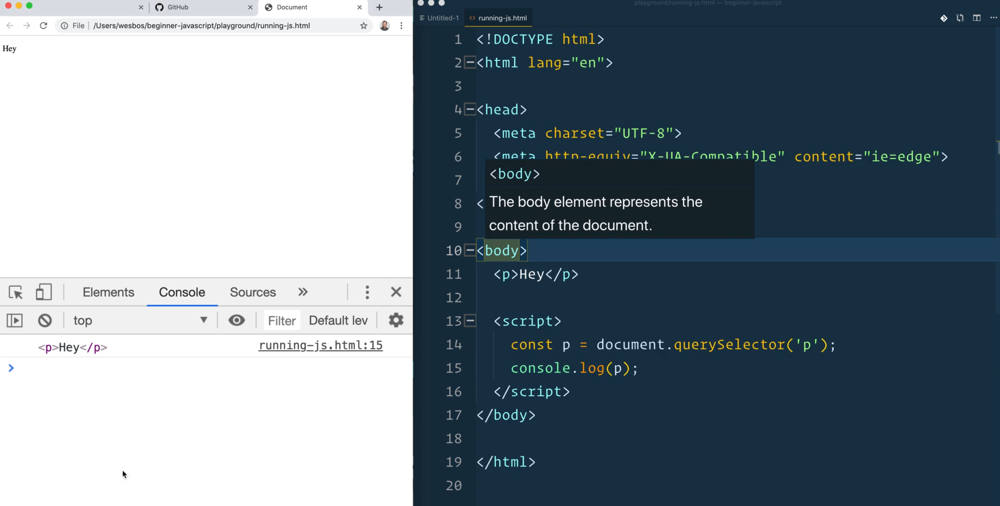

If you were to move the script tag above the paragraph (or move the paragraph below the script tag), and refresh the page, the console will show `null` because that means it found nothing.


In order for your script tag to access the elements on the page, the elements must first be on the page before you select them. If we try to select something that doesn't yet exist (because it gets created later), we won't have access to it.

For your own sanity, always put your JavaScript right below the closing body tag. (_We will talk about loading in future videos when we get a little bit more into the DOM)._

### External JavaScript Files

Another way we can do it is via an external JavaScript file.

Go into the playground and make an external JavaScript file, called `some.js`.
In that file, add the following code 👇

```js
console.log("I am in another file");
```

In the `running-js.html` file, remove the existing script block and instead add a script tag with a `src` attribute. (_You do not need a `type=` attribute until we hit **modules**._)

Inside of the `src=` attribute, you need to give it a relative path, like so 👇

```html
<script src="./some.js">
```

That works because the HTML file is in a folder where the sibling is `some.js`.

- `./` means in this folder. -`../` would mean go up a level.

In our case, it's in the same folder so `./some.js` is the relative path to our file.

Now if you run that, it will say in the console `I'm in another file`, and it will even show you where that JavaScript had been run. 👇


Again, if you were to put the script inside the HEAD, it will still work.

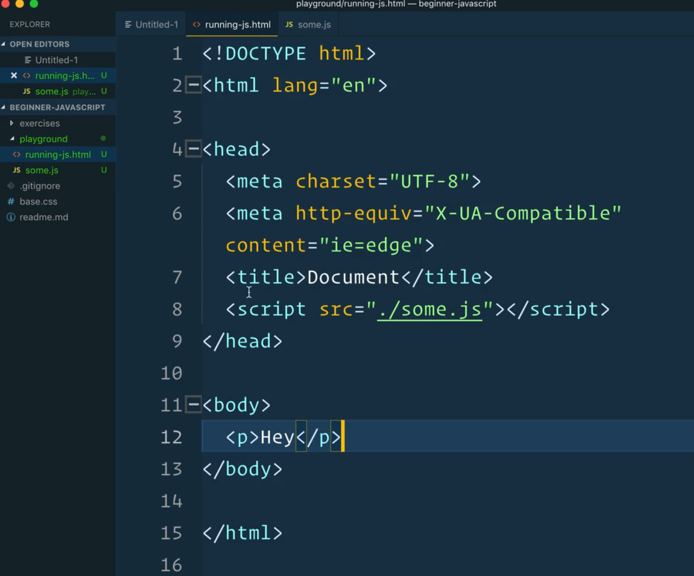

However, if you were to try to select some things on the page, such as the paragraph tag, you will get null.


Why? Because of the same reason --the script will run before the actual HTML is finished building on the page. Leave the script tag right before the closing body tag for the best performance and to save yourself future debugging headaches.

_(There are some options like the `async` and `defer` attributes you can add to your script tags that will delay the actual running of the JavaScript, and it will download it asynchronously and then run it once the HTML has been loaded, however that is a much more advance topic which we will get into once we discuss async. But first we will need to understand what does asynchronous mean, etc)_

Another thing you may have noticed is why is there a closing script tag if there is no content in between the opening and closing tag?

That is a quirk with the script tag. It cannot be self closed.

You also cannot add extra JavaScript between the script tag like so: 👇


That will not work.

You can have multiple script tags, if you like.

The only downside to that is that every single time that it hits one of those, it will go off and download and parse that for you.

When we hit modules, we will look at how we can bundle those multiple files into one. Or you can do something called code splitting, which is split them into multiple, smaller JavaScript files, and have them load on demand.

### Running it in NodeJS

One more is actually running it in NodeJS.

```js
console.log('I'm from node')
```

NodeJS is JavaScript that can run in the server.Instead of running JavaScript on a website, we run it on an actual machine (like many other programming languages do).

The way we do that is we open our terminal and `cd` into the playground directory.

You can run the script in node by entering the following in the terminal and hitting enter 👇

`node node-example.js`

That will run whatever code is in the script file, and once it's done, it will exit out of node and return you to the terminal.


That's the short of how to load JavaScript.

We will be using a mixture of running JavaScript in the console, in a script tag and in external JavaScript files.

---

## 04 - Variables and Statements

This video is going to teach you an introduction to variables.

**Variables** are a building block of JavaScript, and you can't use JavaScript without knowing variables.

We will cover what they are, what the different types of them are, what declaration means as well as what a statement is in JavaScript.

Go into the `/playground` folder and make a new file `variables.html`.

Use the HTML base snippet and add a script tag within the body.

To make sure everything is working, add a `console.log('hey');` within the script tag. _Wes will explain the use of the semi colon shortly_.

If you open up the `variables.html` file in the browser, you should see 'hey' in the console.


There are three different ways to make a variable, which in JavaScript we refer to as _declaring a variable_. They are:

1. `var`
2. `let`
3. `const`

### var

Let's start with `var`.

To make a variable you say `var` and then you make a name of the variable. You can use almost anything for a variable name _(we will discuss restrictions shortly)_

```JavaScript
var first = "wes";
```

What we have done there is created a new variable called `first` and we set it to a string of 'wes' _(we will discuss what a string is in a second)_.

Now, if you refresh the `variables.html` page, and type into the console `first`, you will see that we actually get the value that is inside of that variable.

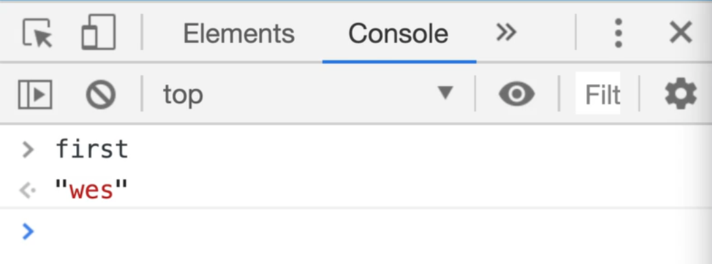

You can also do it by doing a `console.log()` like so:

```html
<body>
<script>
  var first = 'wes';
  console.log(first);
</body>
```

### let

The second way to declare a variable is with `let`.

Below the declaration of the variable `first`, add 👇

```js
let age = 300;
```

If you refresh `variables.html`, and type in age, you will see 300 returned in the console.

### const

The third way is with `const`. Below the `age` variable, add the following: 👇

```
const cool = true;
```

That is what is called a constant variable.

The naming of these things aren't great. Const means constant, but it's still called a variable.

`var`, `let`, `const` are all different types of variables, and there is different ways to declare the variables and we will talk about the pros and cons to all of them in just a second.

### Statements and Semi Colons Semi-Colons in JavaScript

Before we do that, let's discuss the semi colon Wes is adding after each JavaScript line.

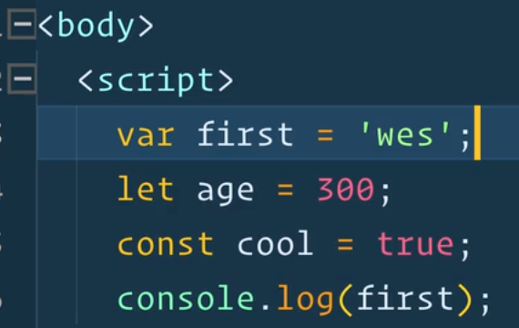

Semi-colons are used to terminate the line of JavaScript. Below is an example of what is referred to as a **statement** in JavaScript.

```js
var first = "wes";
```

**A statement** is an instruction to the computer, browser, the JavaScript interpreter to do something.

This can usually be summarized as a variable was being declared, a variable was being updated, a function was being called, something was logged to the console.

Anytime you want to do something in JavaScript, that is referred to as a statement.

When you are done your statement, you add a semi-colon to the end of the line.

```js
var first = "wes"; //variable declaration statement
let age = 300;
let cool = true;
console.log(first); //function call statement
```

### Code Blocks

One thing that we will run into in JavaScript is something called a **code block**.

For example, add the following line of code to `variables.html` and refresh the page

```js
if (age > 10) {
  console.log("you are old");
}
```

You should see the message "you are old" in the console.

The question is how come we _didn't_ put the semi-colons after each line like this 👇

```js
if (age > 10) {
  console.log("you are old");
}
```

That is because it's something that is referred to as a **code block**.

Code blocks are things that are bound by these curly brackets `{` and `}`.

Things like function definitions, if statements, loops do not need a semi-colon at the end because you aren't telling the computer to do something. In those instances, you are just running some code and telling the computer to do something inside of the block.

Throughout the course Wes will continue to mention why we do and do not use the semi-colon so you can get the hang of it.

It is possible to get away without writing semi-colons in JavaScript because there is something in JavaScript called _ASI_, which is **automatic semi-colon insertion** but we are not cover that because it's a much more advanced topic.

### Differences between var, let & const

Let's talk about the difference between the three types of variables.

Remove all the extra JavaScript code within `variables.html` except for:

```html
<script>
  var first = "wes";
  let age = 300;
  let cool = true;
</script>
```

`var` and `let` can be updated.

If you ever want to change what the value is of one of those variables, you can simply just change it.

For example, if you add the following line of JavaScript, refresh `variables.html` in the browser and type `first` in the console, you should see the value `westerhoff` returned.

```html
first = 'westerhoff';
</script>
```


The same can be done with the age variable.

For example type in the console `age = 400`. That updates the value of the `age` variable.


You can either run the JavaScript from the `variables.html` page, or you can run them from the console. Because the variables in `variables.html` are **global variables** _(which we will cover in a future video)_, we can modify the either in the script tag within `variables.html` or directly from the console.

Notice that we do not have to redeclare the variable. We did _not_ have to do something like this:

```js
var first = "wes";
let age = 300;
let cool = true;

var first = "westernhoff";
```

That is actually a bad practice and in most cases, won't even work.

You only need to declare the variable with `var`, `let`, or `const`, and then whenever you want to update the value, you don't need to put the keyword in front of it, you can just go ahead and set it to it's new value.

You **cannot** set a const variable to be something else. If you were to go `cool = false`, you will see the following error: 👇

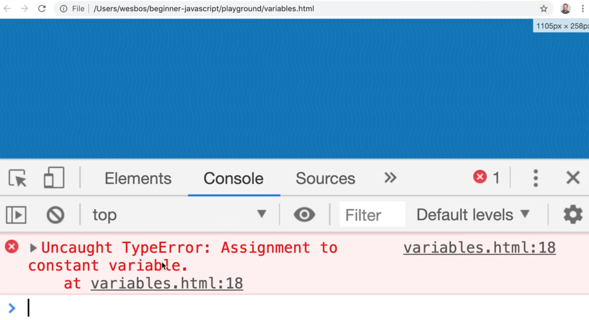

Errors in JavaScript will tell you what went wrong and where it went wrong. Here it says 👇

> Uncaught TypeError: Assignment to constant variable on Line 18.

That error is describing exactly what we did, which was we tried to change a variable that was set to a constant.

Constant variables cannot be changed, so think of them like an **API key** or something that you never want changed. You set those to a constant, and the value of that variable can never be changed.

It not not totally true that it can never be changed, which we will follow up when we hit arrays and objects _(meaning that there is a difference between the array or object that it is bound to and the values that live inside of it)_.

What we need to know right now is just that `var` and `let` variables can be changed or updated, and `const` variables cannot.

#### Strict Mode

The next thing you need to know about variables is this thing called **Strict Mode**.

_🔥Tip: While in your code editor, you can select a block of text and on your keyboard press `Command` + `/` to comment out your code. Commenting out code makes your browser skip that code. It'll still be there, but the browser will not run it._

If you put this code in the script tag, refresh `variables.html` and write dog in the console, the console will return the value of "snickers".

```html
<script>
  // var first = 'wes';
  // let age = 300;
  // let cool = true;

  // first = 'westerhoff';
  // cool = false;

  dog = "snickers";
</script>
```

We made a variable even though we did not `var`, `let`, or `const` it.

What is going on? How can that happen?

Now if we go to the top of our opening script tag, and add `use strict;` and then refresh the page, we will see the error

> dog is not defined


In the early days of JavaScript, it was possible to create a variable without first declaring it, and the browser would just add the var on behalf of the user.

That leads to bad code down the road, it's pretty sloppy and it's not something that you want to do. So what happened?

JavaScript still supports the old method of not declaring a variable because it has to be backwards compatible with early JavaScript code.

But they can introduce new modes into the browser like strict mode, which will throw an error if you try to do something like not declaring a variable properly.

```js
var dog = "hugo";
dog = "snickers";
```

First you are declaring the variable dog and then updating it with the value of snickers.

Another thing you can do is just declare a variable and then update it on the next line like so 👇

```js
var dog;
dog = "snickers";
```

That will work because what happens here is if you comment out the second line so it's just `var dog;` and refresh `variables.html`, when you type dog into the console you will have the value of "undefined" returned to you.


Strict mode is useful but we won't be typing it every time in this course because we are going to be following best practices and it is enforced by default when you are using **JavaScript modules**, and modules are probably how you are going to be writing all of your modern JavaScript.

#### Scoping

Now let's talk about the second difference between `var`, `let`, and `const`, which is scoping.

Clear your JavaScript code until it's back to the three variables we had at the beginning.

```js
var first = "wes";
let age = 300;
const cool = true;
```

Scoping in JavaScript answers the question "_Where are my variables available to me?_"

We are going to have an entire section of this course focused on scoping because it's such a fundamental part of JavaScript, but for now we need to know that:

- `var` variables are scoped differently than `let` and `const` variables.

- `var` variables are what we refer to as **function scoped variables** (they are only available within the parent function).

- `let` and `const` variables are what we refer to as **block scoped variables**.

What does this mean?!

We are going to learn what blocks and functions are in the future. Since we haven't covered that yet, just put that on pause temporarily until the functions and blocks video. We will continue on in the functions and block video about this.

The question is, what are we going to be using in this course?

They are all valid.

`let` and `const` were introduced as part of what is called es6, which is only a couple of years old. `var` has been around since JavaScript has been invented.

You may sometimes see people say `var` variables are old or deprecated, but they are not.

It's just that some developers (Wes included) prefer to use `let` and `const` because the block scoping makes more sense as well the benefit of assigning a constant value to these constants and not accidentally overwriting a variable which can lead to bugs.

Here is how Wes' approaches deciding which of the three to use:

- _He uses `const` by default._ Anytime he is assigning a new variable, he just defaults it to `const` because he doesn't know if he'll need to be updating that or not.
- _If he needs to change a value of a variable, he will use a `let`._ Sometimes he will make a variable `const` and then realize he needs to update it so he will make it a `let`.
- _Wes almost never uses a `var` variable._ There are some exceptions like when declaring a variable outside of a block but we will go into more detail about that shortly.

#### Naming Conventions

Last thing we need to talk about is **naming conventions**.

What can you call your variables?

As a convention, variables should _not_ start with a capital.

For example, the code bellow will work in the browser. It is not wrong or broken JavaScript, but it's convention that variables should not start with a capital unless they are a class _(we will get into what classes are in the future)_.

```js
const Dog = "bowser";
```

Variables must start with either an a-Z letter _(a,b,c,d etc)_. They can also start with or contain an underscore `_` or dollar sign `$`.

For example you could add the variable below and it would work. A variable like `$_$` would also work.

```js
const $$$$$$$$ = 100;
```

`$` and `_` are the only non a-Z characters that can be used inside of variables.

_Tip: the `_`is sort of synonymous with a library called lodash, and the`$ `is sort of synonymous with a library called jQuery so you don't normally make your variables called $ or _ because they have sort of been taken as a convention. You can however certainly include them if you want._

#### Camel Casing

Sometimes a variable is made up of two words, for example 👇

```js
const iLovePizza
```

This is referred to as **camel case**. With camel case, every word inside of your variable will contain an uppercase except for the first one, for the reasons we just talked about.

Upper camel case is where you do start it with a capital (_ILovePizza_), however that is almost never used in JavaScript unless you are defining a class.

### Snake Case

There is also something called **snake case**.

Instead of using capitals between words, you use underscores. For example `const this_is_snake_case = 'cool';`.

```js
//camel case
const iLovePizza = true;
// UpperCamelCase
const ILoveToEatHotDogs = false;
//snake case
const this_is_snake_case = "cool";
```

### Kebab Case - Not Allowed

There is also something called** kebab case**, for example `const this-is-kebab-case` but this is **not** allowed in JavaScript.

Most developers will always use camel case, UpperCamelCase if you are building a class, some people like underscores and kebab case is not allowed.

---

## 05 - Code Quality Tooling with Prettier and ESLint

Whether you are a solo developer looking to follow best practices or catch potential bugs, or you are a member of a team that has a specific way of writing JavaScript, there are many use cases for using code quality tooling.

There are two tools that are extremely helpful in code quality and formatting of your JavaScript:

1. ESLint
2. Prettier

Before we jump into those, let's start by looking at some code and opinions people have about formatting in JavaScript.


In the code above 👆, we are using single quotes `''` rather than double quotes `""`, , which is an opinion that people have. Some people prefer one over the other.

The fact that there is a space between the variable name and the equal sign is actually not necessary in `const p = document.querySelector('p;)`, that is an opinion that people have in their JavaScript. `const p=document.querySelector('p');` would work the same way.

Those are just two example of things that have the potential to cause issues in your code, or are formatting preference that people have opinions about.

The tools we mentioned earlier will help you fix those issues by either fixing it for you, or by alerting you if you are doing something that is a bad practice, or causes an accessibility issue, along with a whole lot of other things.

### ESLint & Prettier

I recommend that you go to https://eslint.org and go to the demo.

For Prettier, there is a link on the homepage that says "Try it".


We will cover:

- what they are
- how they work
- the steps you need to go through to install them

#### ESLint

**ESLint**, is a JavaScript linter tool for identifying and reporting potential issues in your JavaScript. Some examples may be bad practices or design patterns, or identifying unused variables in functions.

If you go to the ESLint demo, select the "Rules Configuration" section and choose the latest version of JavaScript.

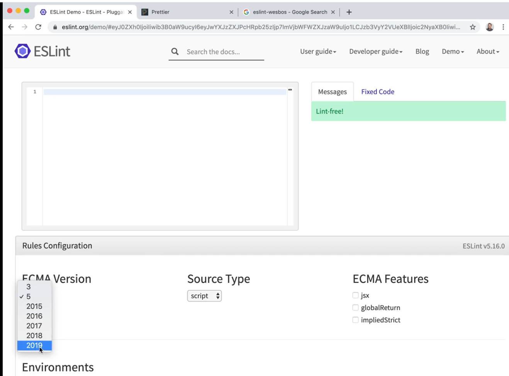

If you type into the demo `const age = 300;`, you will see the following linting rule 👇

> 'age' is assigned a value but never used.


If we go ahead and use it by adding a line below of `console.log(age);`, we will get the following errors 👇

> 3:1 - Unexpected console statement
> 3:1 - 'console' is not defined.

One of the rules that are set in the demo version of ESLint is to not use `console.log()`, which is sometimes a production rule that developers use because you don't want to ship code to production that include console logs.

With ESLint, you can turn specific rules on or off. Wes will show us his own config shortly.

If you scroll down on the ESLint site, you will see a list of all of the rules that you can set using ESLint.

Sometimes are you are writing code, ESLint will throw an error and you might not know why it is being thrown. THankfully, ESLint provides a link to the documentation of the rule so you can read through and understand what it means.

Some other thing ESLint helps with is is broken or confusing scoping.

Let's say you add the following code 👇

```
function hi(){
  age = 300;
}
```

You should get the following errors: 👇

> 1:10 - 'hi' is defined but never used.
> 2:3 - 'age' is not defined.

If we add a `let` before the age variable, it will still complain that `hi` is defined but never used.

If we call `hi()` in our code, it just complains that age is assigned but never used.

ESLint is always giving you feedback on your code.

Initially, this can be very frustration because it tells you that all your code is wrong.

Over time, you will be able to modify your own config that fits your own coding style as well as wise up to why some of those things might be bad practices.

ESLint is also plug-able.

This means you can have many different plugins with it, there are many of them, for different styles of JavaScript, such as a React/Vue/Angular plugin.

That is a high level overview of what ESLint is. We will talk more about configuring it in just a second.

#### Prettier

The next tool that we have is Prettier.

Whereas ESLint will yell at you about things that are causing potential issues in your code, Prettier focuses entirely on just the formatting of your code.

Navigate to https://prettier.io/ and select the "Try me option" which should open up the playground.

Paste the following code in it 👇

```js
const age = 100;

alert("hey");
```

The output should give you:

```js
const age = 100;
alert("hey");
```


The input code is technically valid JavaScript, however it is messy and harder to read. Those are annoying things, things such as indentation.

Prettier will take in all of your code.

For example if you are mixing your quotes, using single quotes `'` sometimes and `"` double quotes at other times, Prettier will always just format the code to use one or the other, for consistencies sake, depending on the settings you have.

Prettier is pretty opinionated.

There are a few settings that we can toggle here or there, but mostly you just have to let it figure out how you want it to format you code.

You can use ESLint and Prettier separately.

What Wes likes to do is use ESLint and then use the Prettier plugin for ESLint. That way, all of his code goes through ESLint which will tell him what is wrong with his code, as well as any possible issues that ESLint can fix, including Prettier fixes, and then it will go ahead and fix those for us.

One bad thing about ESLint is after you install it, you can spent the rest of your life configuring it based on the hundreds of possible rules.

It is likely that the rules you want have already been chosen well by someone else, so often you just want to pick someone elses  settings that you already like.

That is exactly what Wes did for this course.

He made a config that is a set of ESLint rules, as well as the Prettier plugin which will do the formatting for you, all bundled into one so you can hit the ground running with that config.

As you start to develop your own opinions for what you like, you can sort of overwrite those ESLint rules one by one.

### Installing ESLint & Prettier

Let's get into installing Prettier and ESLint.

Go into the terminal, and use it to navigate to the `beginner-JavaScript` directory.

_Tip: If you don't know which directory you are currently in, enter `pwd` in the terminal and it return the directory that you are currently in._

There are a few things we need to do before we can get going.

We are going to follow the instructions located at https://github.com/wesbos/eslint-config-wesbos.

You can install this globally or per project.

What Wes does is he usually installs it globally so that all the projects he works on are covered, and then for each individual project that is more than a demo, he installs it locally.


### Installing npm packages locally

We will be installing it locally per project, because that is the way you probably should do it for all of your projects.

If you don't already have your `package.json`, create one running the command `npm init` by typing into the terminal `npm init`.

We will be talking about npm later in this course, but essentially npm allows us to download what are called **dependencies**, which is other people's JavaScript packages that allow us to do things. We need other people's JavaScript packages for this lesson, specifically we need ESLint, we need Prettier, and we need Wes' config.

### Creating the Package.json

In order for that to work, we need what is called a `package.json` file which is going to hold a list of all of the other things in JavaScript that we need.

To create the `package.json`, you simply just type `npm init` in the terminal and press enter.

You will now be prompted to enter a package name, description, keywords etc but you can just press enter to skip setting those values for now.

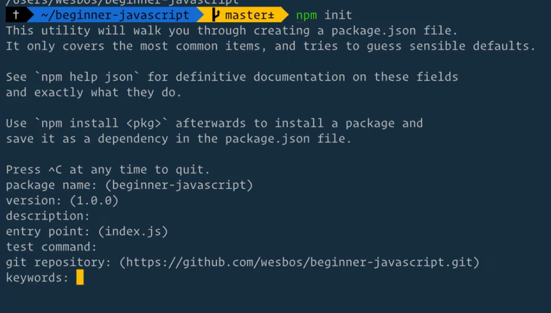

Then we need to go ahead and install all of our dependencies for this thing.

Go ahead and copy the line of code in step 2 of instructions to install per project.

```jsx
npx install-peerdeps --dev eslint-config-wesbos
```

After about a minute or so, it will go ahead and install all of your files.

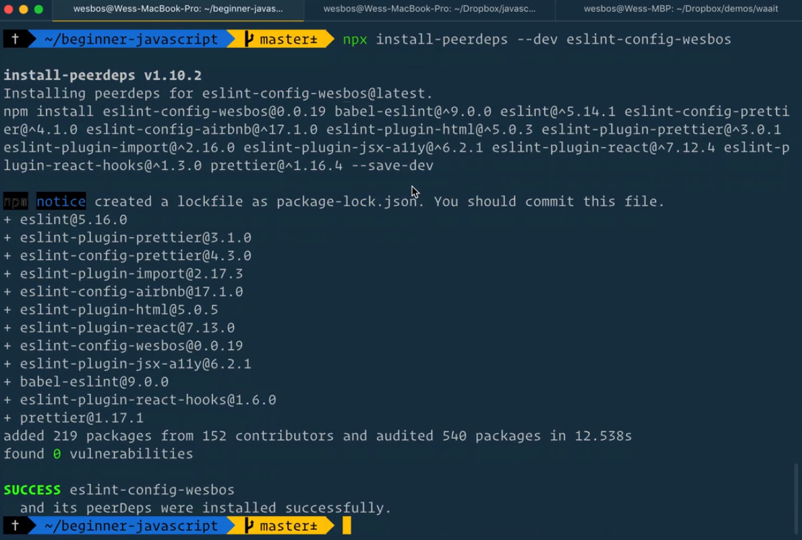

If you take a look at your file system, you will see that there is this new folder called `node_modules/` and inside there are a whole bunch of dependencies.

We're not going to get into what that is just yet, that will be coming in our modules lesson. For now, all we need to know is it contains all of the JavaScript that makes ESLint and PRettier run.

Next we need to make a new file within the `beginner-JavaScript` folder, called `.eslintrc`. This is what is called a **dot file**.

Sometimes your computer will hide dot files from you because they are typically just files that developers use under the hood. Since we are developers, we do not want to hide those files.

If you have trouble seeing that file in your file system, do a quick google of "Showing hidden files Mac" or "show hidden files Windows" and it will show you how to flip that on.

Inside of your `.eslintrc` file, copy the following:

```json
{
  "extends": ["wesbos"]
}
```


We are going to extend "wesbos", which means we are going to extend all the settings and plugins that Wes has packed into his own config. That is really all we need right now.

Next, what we need is to get it running with VSCode.

Scroll down in Wes' instructions to the **With VS Code** section.


First thing you need to do is install the ESLint package for VSCode.

`Ctrl` + `Shift` + `X` will get you to the list of extensions in VSCode.

You want to search ESLint, and you will see a whole bunch of different ones, but the one you want is just called ESLint. You'll know it's the right one because it has billions (just kidding, millions) of installs.

Go ahead and click the install button.

Now what we need to do is setup some VSCode settings. Within VSCode, in the right hand corner, navigate to _Code > Preferences > Settings_.

If you're on Windows, that would be _File > Preferences > Settings_ and then you should see one called Settings.


That should open up the settings section in VS Code like so 👇

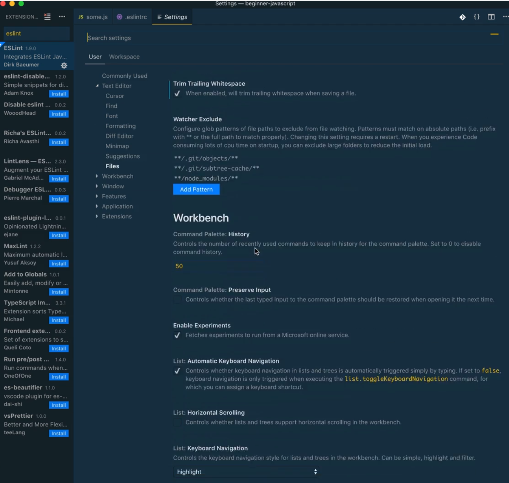

What you want to do is click on the curly brackets in the top right hand corner 👇


That will open up the text based version of your settings.

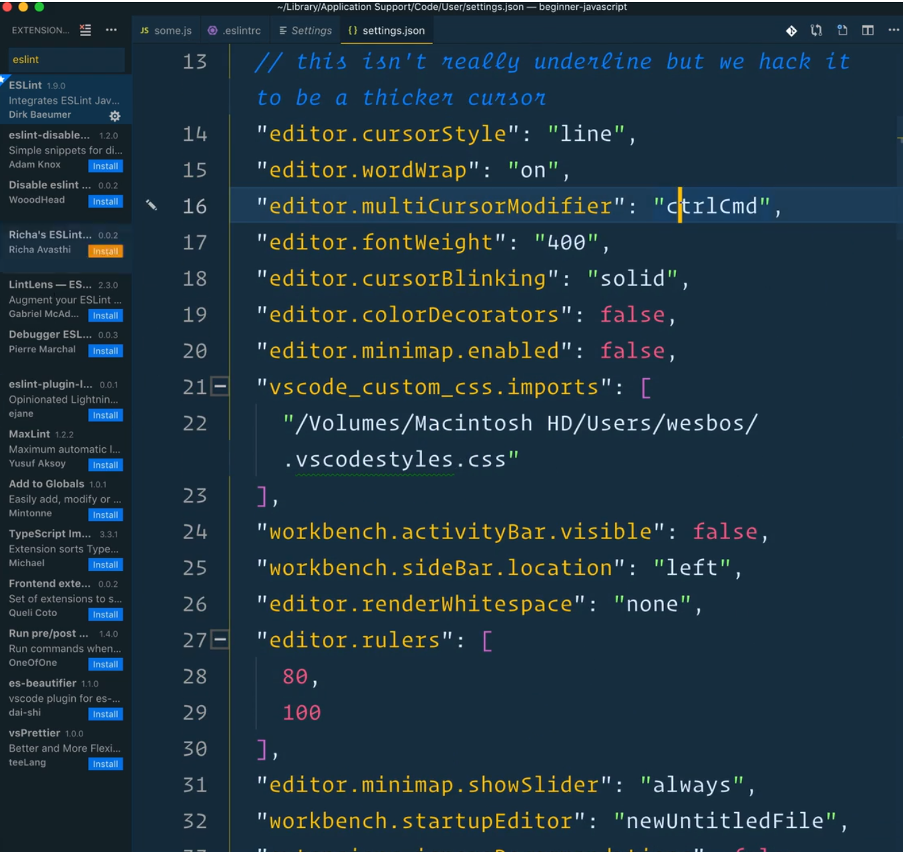

Simply just copy all of the settings from **Step #2 of the "With VS Code"** instructions found on Wes' config file (https://github.com/wesbos/eslint-config-wesbos).

Go to the very end of the `settings.json file` in VSCode, and after the last value, add a comma and then paste in the settings we just copied.

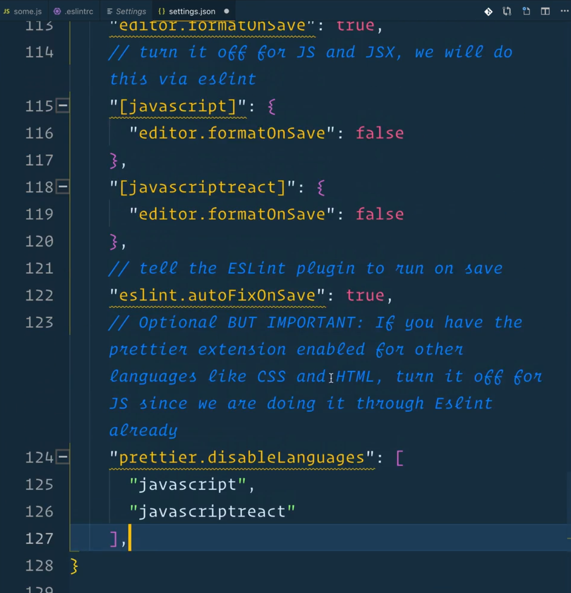

Let's go through the settings really quickly.

`editor.formatOnSave:true`: turns on the format on save.

```js
"[JavaScript]": {
  "editor.formatOnSave":false
}
```

The setting above 👆 is responsible for turning off formatting on save for JavaScript.

The setting below is responsible for telling the ESLint plugin to run on save. 👇

```json
"eslint.autoFixOnSave":true
```

You need to do that to prevent other built-in plugins from VSCode from clashing with our ESLint plugin.

The built-in plugin in VSCode for formatting is called **Beautifier** and it doesn't do as good of a job as ESLint and Prettier, so what the settings are doing is turning off the editor format on save for JavaScript and for javascriptreact and using the ESLint fix on save instead.

Finally, this is important: if you already have a prettier extension enabled, you want to disable it for JavaScript and javascriptreact using the following setting 👇

```json
"prettier.disableLanguages": ["JavaScript", "javascriptreact"],
```

Why? Because we are not using Prettier directly through the Prettier plugin. We are using Prettier through the ESLint plugin.

This stuff can get confusing and be a real bummer, so if you get stuck or have trouble, watch the video again and check out Wes' troubleshooting tips in Wes' config file instructions.

To check if Prettier is working, you can open a JavaScript file in VSCode, add some add extra whitespace between variables and equal signs and then save the file.

If it isn't working, you can click on ESLint in the bottom corner and it will often tell you what the issues are with it actually running.


Another thing you will notice with ESLint is these squiggly underlines in VSCode👇


That is actually ESLint telling giving you information about a warning or error it is throwing.

ESLint won't automatically fix these problems for us on save, it just explains what the issue is and then it's up to you to make a decision on how to solve it.

If you modified the code to be `let age = 100;` ESLint will give you a warning saying you used a let but never modified the value, maybe you wanted to use a const instead.

If you modify the code to be `const age = 100;`, the underline under the age variable will be yellow and the warning will say `

> 'age' is assigned a value but never used. eslint(no-unused-vars)


Red squiggles represent an error and yellow is just a warning is an error, and yellow is just a warning.

We will be using that a lot during this course.

If throughout the course there is a setting you really don't like, you can go ahead and modify the `.eslintrc` file to disable that rule.

That works by creating a `rules` property like so 👇

```json
{
  "extends": ["wesbos"],
  "rules": {
    "no-console": 2,
    "prettier/prettier": [
      "error",
      {
        "trailingComma": "es5",
        "singleQuote": true,
        "printWidth": 120,
        "tabWidth": 8
      }
    ]
  }
}
```

You can set rules to:

- 2 if you want them to error
- 1 if you want them to warn
- 0 if you want to ignore that rule entirely

If you get stuck, try for about 20 minutes and if you are still stuck, jump into the Slack chatroom and ask for help.

---

## 06 - Types - Introduction

So far, we have just been assigning values to variables, such as numbers, text, true or false. What are all those things, and what are all of the different possible options that we have? These are referred to in JavaScript as **Types**.

Anytime that you have a value (a value is something that can be stuck inside of a variable, or passed to a function), it will fall into 1 of the 7 JavaScript types.

The types in JavaScript can be remembered using the word `SNOB'N'US` (just kidding, that is pretty hard to remember).

The 7 Different Types in JavaScript are:

1. **String** - _a string is anytime that you have some text (you will often see that in a single or double quote or a backtick)_
2. **Number** - _a number (regardless of whether it has a decimal place in it. Some programming languages have multiple types to deal with numbers, but JavaScript only has the one.)_
3. **Object** - _This is a special one, we will go over this one last. Everything in JavaScript is an object, and we will understand what that is when we start to hit methods. Everything that we use like functions, dates, and arrays are just objects at the end of the day. All the other types except for object are referred to as the "primitive types"._
4. **Boolean** - _true or false_
5. **Null** - _can be used to set a variable to nothing (we will discuss difference between undefined and null shortly)_
6. **Undefined** - _can be used to set a variable to nothing (we will discuss difference between undefined and null shortly)_
7. **Symbol** - _this is a new one to JavaScript, and it will always give us a guaranteed unique identifier. This is useful for when you are trying to come with a unique identifier inside of an object and you want to make sure you are not also overwriting something that already exists with that id._

---

## 07 - Types - Strings

Create a new file called `types.html` and we will use our HTML base snippet.

Add the following code 👇

```html
<!DOCTYPE html>
<html lang="en">
  <head>
    <meta charset="UTF-8" />
    <meta name="viewport" content="width=device-width,initial-scale=1.0" />
    <title></title>
    <link rel="stylesheet" href="../base.css" />
  </head>

  <body>
    <script src="./types.js"></script>
  </body>
</html>
```

Create a new file `types.js`.

Add a console log such as `console.log('it works')` and save the file.

Once you have done that, open the `types.html` page in a browser and take a look at the console to test that it works.

Strings are used for holding text. THere are three different ways to create strings in JavaScript:

1.  Single Quotes `'text'`
2.  Double Quotes `"text"`
3.  Backticks `` `text` ``

Add the following to your `types.js` file 👇

```js
const name = "wes";
const middle = "topher";
const last = `bos`;
```

When you save the file, you might notice that our double quotes were replaced with single quotes because of our ESLint rules.

### JavaScript Comments

We want to disable that, which you can do by adding a comment.

This is a different kind of comment than this style `//comment` which Wes' has already showed us. The two forward slashes comments out the entire line.
You can also put a double slash comment at the end of a line.

A `/*` comment will open up what is called a **block comment**. You can close the block comment anywhere you wish to close it (it can be multiple lines).

To disable the ESLint rule, we will use a block comment even though the comment only spans one line, because that is what ESLint is looking for.

On the first line of `type.js` add the following block comment 👇

```js
/* eslint-disable */
```

Next take the value of `'topher'` in the `middle` variable and put the double quotes back around `"topher"` and save the file.

The double quotes should remain because we have disable ESLint for the entire file. _(It is possible to disable ESLint for just one line.)_

For Wes' Prettier settings, he usually sticks with single quotes or backticks. He has been considering switching to just using backticks entirely.

### Difference between Single Quotes, Double Quotes and Backticks

What is the difference between single quotes, double quotes and backticks?

Single quotes and double quotes are exactly the same thing.

The only reason that we have them both is because if you were having a sentence like `const sentence = 'she's so cool';`, it would break your JavaScript because the JavaScript interprets the apostrophe as closing the string.

If you were to make that change, save the file and then refresh `type.html`, you will see an error that says

> Unexpected identifier


In that case, there are a few things we can do.

First, we can do something called **escaping**. Escaping in JavaScript allows you to tell JavaScript "No, I actually want this character, don't interpret it as JavaScript syntax, interpret it as text.

Escaping is done with a backslash.

For example, change that line of code to be `const sentence = 'she\'s so cool';` and refresh the page. This can get annoying. Another challenge is what if you actually want a back slash in your text? You would have to escape it like so 👇

```js
'she\'s so cool \\';

```

The other better option is to just use double quotes instead, so the apostrophe doesn't get interpreted as the end of the string.

Another bummer is sometimes you want to use both, for example let's say you wanted text that said 👇

```
"she's so "cool""
```

You would have to escape the double quotes like so 👇

```js
"she's so \"cool\"";

```

The third option is using backticks. With backticks, you could simply do 👇

```js
`she's so "cool"`;
```

The only downside to this approach is if you needed a backtick in your string, you would need to escape it like so 👇


That is one of the benefits to using backticks.

#### Putting String on Multiple Lines

The next thing is putting strings on multiple lines.

Let's say you wanted to add the following song as multiple lines of text 👇


You can see that the editor is complaining about the string not being closed properly. How do you do multi-line strings?

If you want to, you have to put a forward slash at the end of every single line, and that will allow you to put a string on multiple lines.


The benefit to using backticks is you can have multi-line strings and they maintain the line breaks inside of them.


Sometimes the console will return the value like `"Ohhh↵↵ya↵↵I like↵pizza"`. Those arrows indicate a new line.

Backticks will be extremely helpful when we want to make HTML.

For example, using backticks allows you to do something like this 👇

```js
const html = `
  <div>
  <h2></h2>
  </div>
`;
```

### Concatenation and Interpolation

Before backticks were introduced, the only thing you could use to achieve that is **concatenation**.

Another benefit of backticks is interpolation and concatenation. Let's define those.

**Concatenation** _is when two or more strings are combined into one_.
**Interpolation** _is when you put a variable inside of a string_.

In `type.js` add 👇

```js
const hello = "hello my name is. Nice to meet you";
```

Let's say we wanted to add our name to the end of the "hello my name is." sentence.

Previously, with single and double quotes, what you have to do is close the quote, put a plus _(which is concatenation)_, and then you put your variable, and then another plus like so 👇

```js
const hello = "hello my name is" + name + ". Nice to meet you.";
```

That is one way of interpolation (using concatenation). _You could do the same thing with single quotes, like mentioned previously, there is no difference between the two types of quotes_

Here is yet another way to do this 👇

```js
let hello2 = "hello my name is ";
hello2 = hello2 + name;
hello2 = hello2 + " Nice to meet you";
```

That is just annoying, because we are just overwriting the variable each time _(we are overwriting it with the value of the variable, plus an addition)._

Both approaches to interpolation are not the greatest.

The `+` sign does two things in JavaScript.

If you use it with a string, it is used for concatenation. But it is also used to add numbers like so 👇

```js
1 + 1 = 2;
```

But if you do `"1" + "1"`, it will evaluate t `"11"`.

If you do `"1" + 1`, it will evaluate to `"11"`.


That is ripe for bugs, so that is where backticks come in with a much nicer solution.

### Backticks

With backticks, you can interpolate the string like so 👇

```js
const hello = `hello my name is ${wes}. Nice to meet you`;
```

The `${}` syntax can only ever be used in backticks. It is the easiest way to pop a variable into a string.

Almost anything can go between the curly brackets (`{}`) in that syntax. For example, you can do math. 👇

```js
const hello = `hello my name is ${name}. Nice to meet you. I am ${1+100} years old';
```

JavaScript will run whatever is inside of the curly brackets in that syntax (whether it is a variable or an actual statement) and it will return the value that's inside of it.

To reiterate: you can do multiple lines with **backticks**, **variable interpolation**, and then there is something a little more advanced that is called a **tagged template literal**, but we are not going to get into that because we haven't got into functions just yet.

Finally, this will be very helpful for creating HTML.

We can do something like:

```js
const html = `
  <div>
    <h2>${name}</h2>
    <p>${hello}</p>
  </div>
`;
```

Now we have all of this html that we have made, and if you add a `console.log(html);` and reload `type.html`, you will see 👇


We can actually do something like this with the html we just created (we will discuss what this means in future videos).

Add the following code below the html variable:

```js
document.body.innerHTML = html;
```

When you refresh `types.html` you should see something like the following 👇


We have just made some HTML! If you inspect the html, you will see it's regular html.

---

## 08 - Types - Numbers

There is only one type of number in JavaScript, which is simply number.

Comment out all the code in `types.js` and add the following 👇

```js
const age = 100;
const name = "wes";
```

Open `types.html` in the browser and then open the console and type `typeof age` and hit enter. The console should return to you "number".


**typeof** is a keyword in JavaScript that allows you to check the type of a value.

You use it by writing `typeof` followed by a space and a variable or value. That will tell you whether it's a number, a string, or any of the other types.

### Numbers in JavaScript

Numbers in JavaScript are pretty simple.

You can create an integer, which is a whole number (100), or you can create a float which is a number that has a decimal (100.5).

Both are used in the same type of number.

There is multiplication division addition and subtraction available to us.

Add the following code to `types.js` and refresh the html page in the browser.

```js
const a = 20;
const b = 10;
```

You can perform the following calculations in the browser👇


The only thing to be aware of is when you are mixing types.

If you try to do math with a string type for example, you start getting into **concatenation**.

That is what we refer to in JavaScript as _"the plus sign is loaded"_ meaning the plus sign can be used with numbers to add, with strings to concatenate, and then there is a lot of room to run into bugs.

If you try to do math with strings, it will convert them for you if you are doing subtraction, division or multiplication, but **not** for addition.

Whenever we are doing math, we need to make sure we are dealing with true numbers and not mixing types.

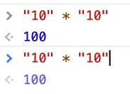

Along with numbers we also have what we call **helper methods**.

If you go into the browser console and type `Math.`, you will see a lot of built in helper methods.


### Helper Methods

There are four you are most likely to use.

1. `Math.round()`
2. `Math.floor()`
3. `Math.ceil()`
4. `Math.random()`

Let's go through each one, starting with **`Math.round()`**.

To use `Math.round()`, you pass a value in between the parenthesis `()`_(that is referred to as **passing a value**, which we will go over in a future video)_. It will return to you the number that was passed, rounded up or down depending on the number.


There is also **`Math.floor()`** which will give you the lower end of that number.

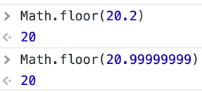

We have **`Math.ceil()`** and that will give you the upper number.


Then there is **`Math.random()`** which will give you a random number every time between 0 and 1 _(in a future video we will go over how to get a random number between 1 and 10)_.

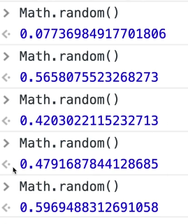

### Modulo and Power Operators

Along with multiplication, division, subtraction and addition, we have two more operators which are called the **modulo** and the **power**.

Let's use the example here where you have a box of 20 Smarties (a Canadian candy), that you need to split up between your 3 kids.

```js
const smarties = 20;
const kids = 3;
const eachKidGets = smarties / kids;
console.log($`Each kid gets ${eachKidGets}`);
```

In the console, that evaluates to Each kid gets 6.66666666667 👇


That is obviously not going to work because you aren't going to split a smartie into a 0.6666.

Instead, what we can do is specify that it is a whole number of smarties that we need and we can't round up because we don't have extra smarties so that is one instance in which we can use `Math.floor()`.

Modify the code to use the following instead 👇

```js
const eachKidGets = Math.floor(smarties / kids);
```

Now in the console you should see that each kid gets six.


Now how many smarties do we have left over?

When you can no longer evenly distribute them, there will be some left over (for dad!). How can you figure that out?

You can use the Modulo operator to tell how many are left after they have bene evenly split up.

In the console type the following, and you should see the value 2 returned. 👇

```js
smarties % kids;
```

and you should see the value `2` returned. 👇

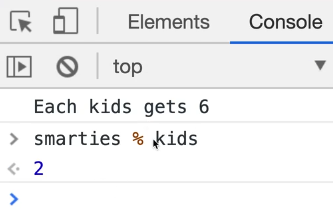

After the smarties have been evenly distributed between the kids, there are 2 smarties left over. The **modulo** operator `%` will tell you how many are left after you evenly divide them.

Add the following to `types.js`👇

```js
const dadGets = smarties % kids;
```

Another example would be there are 10 smarties and 3 kids. If you divide the smarties evenly, there will be one left over.

```js
10 % 3 = 1;
```

### Things to know about Math in JavaScript

Other things you need to know about math in JavaScript is that if you do `0.1 + 0.2` in the console, it will return 0.30000000004.


When people who are learning JavaScript encounter this, they often think that JavaScript is buggy.

Wes suggests trying the following in the browser console: 👇

```js
window.location = `https://${0.1 + 0.2}.com`;
```

That will take you to the following website, that will explain why this occurs in JavaScript.

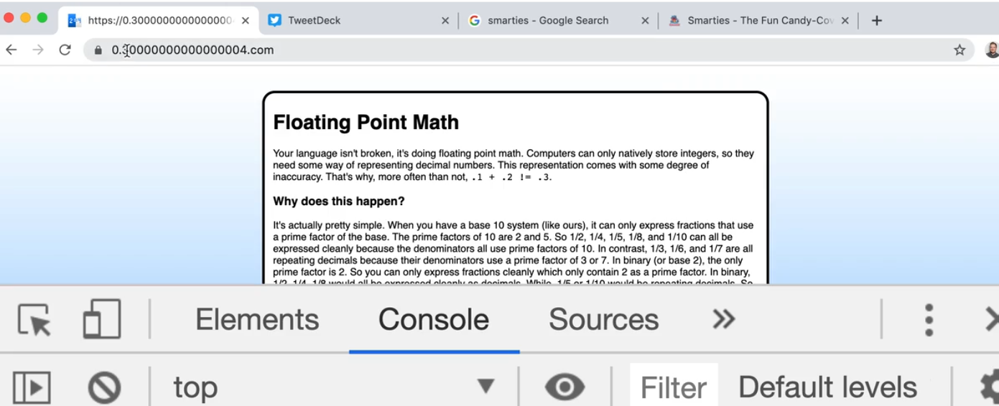

This happens in almost every programming language, and that's just the reality of working with floating point numbers on computers.

One takeaway is that if you are ever working with money, don't store it in dollars and cents.

For example don't do this: 👇

```js
const price = 10.34;
```

That is because if someone gives you a 20 dollar bill, yo can run into issues with the long rounded number and you have a half cent left over you aren't sure what to do with. That is ripe for bugs.

What Wes does is he stores all of his prices in cents, so he is always working with whole numbers and doesn't have to deal with fractions. When he needs to display the price, just divide it by 0 and round the cents _(we will look at examples of displaying money soon)_.

#### Infinity and Negative Infinity

Another thing you should know is JavaScript also has infinity and negative infinity. At the end of the day, there is a max that computers can calculate with numbers. If you try to calculate something that is too high, it will return to you infinity or negative infinity.

We will go over an example.

If you do `10 **`, the double `**` actually means _"to the power of"_. So `10 ** 2` returns 100 and `1000 ** 2` returns 1000000 .


Negative infinity is also a number. Wes has never run into this in his programming, unless you have goofed something up.


#### Not a Number

Another thing to know is `NaN`. NaN means "not a number".

If you try to do something like below, it would return NaN 👇

```js
10 / "dog";
```


**NaN** is a type of "number", which is confusing since it means not a number.


That is something you will run into if you try to do math with something that is not a number. Instead of erroring out, it will just return NaN.

---

## 09 - Types - Objects

**Objects** in JavaScript are the biggest building block and everything in JavaScript is an object.

Objects are used for collections of data or collections of functionality.

We will be going through objects in depth in this course, there is an entire section dedicated to them and we will be using objects throughout all of our examples.

For now, you need to know that when something is an object in JavaScript, it's because we want to group things together.

Up to now, we have been using random variables like `const name = 'wes'` or `const age = 100;`. That is not the best way to do things, because the values are not associated.

What we can do instead is create an object called person.

We will create it using two curly brackets and a semi colon. That is the most common way to make an object, but there are other ways that we will go over.

```js
const person = {};
```

Inside of the person object, you have what are called properties and values. Add the following to `types.js` 👇

```js
const person = {
  first: "wes",
  last: "bos",
  age: 100,
};
```

What we have done here is created an object that allows us to group together variables. In the example above we have first, last and age variables all contained within an object for a collection that is a "person".

In the console, if you type person it will return the value, which is the object. If you check the type of the person variable, it will return the object type.


You can expand the object in the console to see it like so 👇


You may notice that the object properties are in a different order then we put them in within `types.js`. We will go over that after. The short and skinny is that **order doesn't matter in an object. If you need order to matter, use an array.**

To access the properties, there is a couple of different ways we can do it.


We are using the **dot notation** in the examples above.

When we get deeper into objects in the future, we will go over the other ways to do it as well as things like nesting objects and object vs reference and copying objects.

The last type we need to talk is the last type, which is **Symbols**.

What you need to know about it right now is that it is a way to do unique properties (or unique identifiers in general in JavaScript).

There is more to it, but it's complex and typically used by more advanced users (Wes barely ever uses them) so that is all we nede to know for now.

---

## 10 - Types - Null and Undefined

There are two ways to sort of express nothing in JavaScript, and that is with **undefined** and **null**.

### undefined

If you create a variable and don't set anything to it, it will be undefined. 👇

```js
let dog;
console.log(dog);
```


**undefined** is something that has been created (a variable), but has not yet been defined.

The same thing goes for properties on an object. If you type in the console `person.dog` it will return undefined.

Why? Because there is nothing there. That is what undefined is.

It comes about when you try to access a variable that has been created but not set.

If you typed in the console `wes`, you would see an error message returned that said 'wes is not defined' which means that he has never created a variable called wes.

With the dog example we used above, we have created the variable but we have not set a value. That is the difference.

### null

Now we will discuss the **null** type.

Null is a value of nothing, whereas undefined is a variable that has not yet had a value set to it.

We will go over some examples to demonstrate.

In `types.js` add the following 👇

```js
let somethingUndefined;
const somethingNull = null;
```

_NOTE: you cannot use a const variable without setting a value._

`somethingUndefined` is undefined because it does not have a value set, whereas `somethingNull` has the value of null, which is nothing. They are both nothing, but in different ways.

Let's say for example we have Cher and Teller (both of who are real people), who we will represent in objects like so 👇

```js
const cher = {
  first: "Cher",
};

const teller = {
  first: "Raymond",
  last: "Teller",
};

teller.first = "Teller";
teller.last = null;
```

In this example, Cher never had a last name, so she does not have the last property in her object.

Teller on the other hand, got rid of his last name, so we are explicitly setting it to null.

In the console, if you type `cher.last` you will see the value of undefined returned. When you try `teller.last`, the value of null wil be returned.

---

## 11 - Types - Booleans and Equality

The final type in JavaScript is called a **boolean**. A boolean is either true or false, it's like a light switch, it's on or off and that is it.

We use booleans for logic such as if statements.

Booleans can be manually set or calculated.

Let's take a look at some examples.

Comment out all the code you have added to `types.js` so far and add 👇

```js
let isDrawing = false;
```

Let's say we want to know if the user is moving their mouse and if they are currently clicking down or up.

To do that, we can use a **flag variable**, which is a variable that is either set to true or false.

When the user clicks down, we set it to true and when they click up, we set it to false. That is what a boolean is -- something that is either true or false.

We can also calculate booleans. For example, if we have an `age` variable that is set to 18, and another variable called `ofAge` that has the value of `age > 19`, if you console log `ofAge`, it will return false.

```js
const age = 18;
const ofAge = age > 19;
console.log(ofAge);
```


Sometimes values are calculated, like for `ofAge`.

We will talk later about the greater than, less than and equal to operators.

### Equality (equal sign, double equal sign, triple equal sign)

For now, we will just focus on equality which is the equal sign, double equal sign and triple equal sign.

One equal sign `=` is used to assign a value to a variable.

```js
age = 100;
```

For double equals `==` and triple equals `===`, know that you should almost always be using triple equals.

There are some edge cases where you can use double equals, but almost all the time it's better to use triple equals.

If you take the age variable in the console and do the following

`age === 100` will return true
`age === 10` will return false


That is what Wes means by booleans can be calculated as well.

You have 1 value, which can be a straight up value `100 === 10` or it can be a value that is stored in a variable `age === 100` or it can be two variables.

Add `let age2 = 100;` in `types.js`, and refresh the HTML page in the browser.

Now you can do `age === age2` which will return true. 👇


What is happening there is the browser is checking the value of the first variable and then it checks the value of the second one, to make sure they are exactly the same.

What would happen if instead we did `10 == 10`, with a double equals? It would return true. 👇

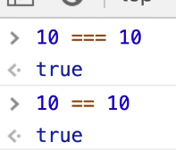

Why are there two different ways to check for equality?

Triple equal will check that the value of the thing on the left hand side and the right hand side are the same, AND it will check that the types of the thing on the left and on the right are the same.

**Triple equals will always check for both value and type.**

In the examples above, the types were numbers.

What if you were to do `"10" == 10`?

The console would return true. Why?

Because the value is the same, but the types are not.

If you did `"10" === 10`, it would return false. 👇


This is one of the examples where you can get into hot water by mixing strings and numbers when doing addition.

You should almost always be working with the same type. The same is true with equality. It's easy to get into hot water if you are checking if a string and a number are the exact same thing.

`===` **always checks that the value and type are exactly the same.**

In a future video, we will go over something called _"**flow control**"_, which is about if, ternary, and switch statements. These booleans will be particularly helpful for those videos.

We will also be extending what we learned here a little bit further into things like truthy and fa`lsy values, as well as this thing called coercion which is where you have a value and you want to force it into a true boolean and what not.
