- [Module 5: Events](#module-5--events)
  * [29 - Events - Event Listener](#29---events---event-listener)
    + [Removing an Event Listener](#removing-an-event-listener)
    + [Listening to events on multiple items](#listening-to-events-on-multiple-items)
    + [`forEach`](#-foreach-)
  * [30 - Events - targets, bubbling, propagation and capture.](#30---events---targets--bubbling--propagation-and-capture)
    + [Propagation](#propagation)
    + [`this`](#-this-)
  * [31 - Events - Prevent Default and Form Events](#31---events---prevent-default-and-form-events)
    + [preventDefault](#preventdefault)
    + [Other Types of Events with Form Inputs](#other-types-of-events-with-form-inputs)
  * [32 - Events - Accessibility Gotchas and Keyboard Codes](#32---events---accessibility-gotchas-and-keyboard-codes)
    + [Difference between Buttons and Links](#difference-between-buttons-and-links)
    + [Keyboard Accessibility](#keyboard-accessibility)

---

# Module 5: Events

## 29 - Events - Event Listener

In this video we will learn about events, event listeners, how to listen to them and how to do stuff when things happen. 

**DOM Elements**, things that are on the page, they emit events for things like when they are clicked, hovered, dragged, they will fire off events when they are interacted with. 

We can use **event listeners** to listen for when these things happen and react to them. 

You can attach event listeners to all elements, as well as the document and the window. 

To demonstrate this, let's start by creating a button. 

Within the `/exercises/29 - Events` directory, open the `events.html` file. 

In the body, add a button with a class of "butts", as shown below 👇

```html
<button class="butts">Click Me!</button>
<script src="./events.js"></script>
```

Create a file `events.js` (if it's not already there). 

If you open the html file, you should see the button and when you click it, nothing should happen. 

 1:32

In order to attach event listeners, you first need to select the element you want to attach it to.

```js
const butts = document.querySelector('.butts');
```

Next, we will call `addEventListener()` on the butt element.

Event listeners will usually take two arguments: 
1. what the type of event is that you want to listen to
2. a **callback function**

A **callback function** is just a regular function, it's just a word we use to describe when we pass a function to a method that will then be called at a later point in time. 

Instead of us calling the function, we provide the name, reference to a function to `addEventListener` and then the browser will take care of calling or running that function for us when it needs to. 

The callback function is our way of saying to the browser
>"hey, when the butts button is clicked, can you please do me a favour and call this function?" 

One of the more common ways to pass the callback function is as an anonymous function. 

For example, 👇

```js
butts.addEventListener('click', function(){

});
```

In the example above, `function(){}` is the second argument that we have passed to the event listener. Inside of that function, we can do whatever we want when things get clicked. For now, let's simply log "IT GOT CLICKED!!".

Now, each time you click the button, you will see that message logged in the console. 

 4:24

_NOTE: For the click event on a button, you don't have to worry about thinking about keyboard events, if the user hits enter to click the button instead of click it, because it's a standard button, the browser will still trigger the click event._

There are three steps with event listeners:
1. Go get something
2. Listen for something (such as a click)
3. Do something

There is a lot more to event listeners, which we will dive into now. 

In our example above, we passed in an anonymous function (it is an anonymous function because there is no name to the function, no way for us to reference that function outside of the listener). 

However, we can also create a named function and pass it in a reference. What Wes often likes to do before creating the event listener is to make a function as shown below 👇

```js
function handleClick(){
  console.log('IT GOT CLICKED!!!!!!!!');
}
```

_Note: the naming of the function to use the word `handle` is not a best practice, but it's often something that Wes does. He will name the callbacks with 'handle', which tells him that it is a specific function that gets passed in to an event handler._ 

Now we can use the following code 👇

```js
butts.addEventListener('click', handleClick);
```

This allows us to still call `handleClick` from elsewhere in our code, as well as from within the console. 

You might notice that we are passing the reference the function like so 👇
```js
butts.addEventListeners('click', handleClick);
``` 

Rather than doing the following 👇

```js
butts.addEventListeners('click', handleClick());
``` 

If you try to run the code with `handleClick()` instead of `handleClick` and refresh the page, you will see the message "IT GOT CLICKED" in the console before we ever click the button. 

That is because it is running on page load when we pass the function as `handleClick()` instead of `handleClick`. 

Unless the function were to return another function, which is something that can happen, you don't actually have to call the function yourself. 

Why? 

Because the browser will run the function for us. We simply pass it a reference so it knows what to run when the time comes. 

What benefit is there to having the function that we are passing to the event listener outside of the function? 

There are a couple of things. 

Let's add another button to the HTML page. 

```html
<button class="cool">Click me also!</button>
```
If we wanted to listen on that button, we could add the following code 👇

```js
coolButton.addEventListener('click', handleClick);
```

Now it doesn't matter which button you click, both of them are referring to that same function.

If instead of re-using the `handleClick` function we wanted to create anonymous functions and pass it two both event listeners separately, that would still work,but if you think of scaling that up to a whole bunch of buttons, then you have to make sure you reference every one of the buttons which is not very **DRY** (**don't repeat yourself**). 

So the first benefit is that it makes the code more **DRY**. 

### Removing an Event Listener

The second benefit is if you want to remove an event listener from an element, you must have reference to the function. 

`removeEventListener()` takes 2 arguments:
1. the event
2. the function  

It is not possible to remove the event listener from all the click events for example. 

You need to pass in the reference to the function you want to stop listening on. 

```js
butts.removeEventListener('click', handleClick);
```

If you refresh the HTML page, you will see the event listener no longer works.

That is called **unbinding**. 

What does **binding** mean? 

A binding essentially means taking a function and listening for a specific click within an element. 

In our examples earlier, the `handleClick` function was bound to the `butts` element. 

The `coolButton` element was also bound to the `handleClick` function and when we took it off, we were **unbinding** that function from that element. 

So if you want to remove the event listener, you _must_ have reference to the original function. 

If we had done an anonymous function, we couldn't have removed the click handler. 

Even if you were to pass the exact same anonymous function to remove, like below 👇, it still would not work. 

```js
butts.addEventListener('click', function(){
  console.log("I am an anon!");
});
butts.removeEventListener("click", function(){
  console.log("I am an anon!");
});
```

As you can see if you run the code, it does not work. That is because there is no way to reference the actual function we wanted to remove. 

If you ever in the future need to remove an event listener, **remember not to use an anonymous function.**

```js
const hooray = () => console.log("HOORAY!");
coolButton.addEventLustener('click', hooray);
```
Shown above 👆is how you would add an event listener with an arrow function.

The `hooray` function is technically an anonymous function, but because we have stored it in a variable, it will infer the function from the variable name and we can still reference it because it's stuck in a variable. 

Those are the basics of event listeners. 

We are going to go into what are the other events that are out there as well and how we can create our own custom events. 

It's handy to be able to emit your own events and then listen to them like you're listening to regular clicks. 

You can use that ability to emit a buy button or buy event, or you want to emit a success event for example. 

### Listening to events on multiple items

Wanting to listen on multiple items is a very common thing. 

Let's say you have 40 buttons on the page and anytime you come across a specific type of button, or a specific type of image, or anything like that, you want to listen for the event for all of the things that are on that page.     

In our HTML page, add the following 👇

```html
    <button class="buy">Buy Item 1</button>
    <button class="buy">Buy Item 2</button>
    <button class="buy">Buy Item 3</button>
    <button class="buy">Buy Item 4</button>
    <button class="buy">Buy Item 5</button>
    <button class="buy">Buy Item 6</button>
    <button class="buy">Buy Item 7</button>
    <button class="buy">Buy Item 8</button>
    <button class="buy">Buy Item 9</button>
    <button class="buy">Buy Item 10</button>
```

_Note: Wes used an Emmet shortcut to create this text by writing `button.buy{Buy Item $}*10` and then hitting tab to expand the HTML._

Now, how can you listen for a click on all of them? 

It doesn't make sense to have to select all 10 of them and then have to attach an event listener 10 times. 

That is actually what we are doing, but there is a much more efficient way. 

First we need to select all the buttons. 

```js
const buyButtons = document.querySelectorAll("button.buy");
```

This gives us a node list of all of the buttons. 

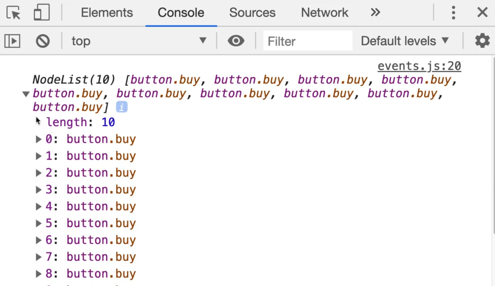

You might think, why can't we just go ahead and take our buy buttons and add an event listener of click like so 👇

```js
function buyItem(){
  console.log('BUYING ITEM');
}
buyButtons.addEventListener('click', buyItem);
```

So we have our elements, we listened for them, and then when that happens, we passed the function to run. 

You should see the following error when you reload the HTML page and look at the console. 👇

 15:41

The error is telling us that the buyButtons does not have the method `addEventListener`. 

Take a look at the `buyButtons` by logging them 👇

```js
console.log(buyButtons);
```

If you ever want to see what all of the different methods are that are available on a variable you can look at the prototype. 

 16:05

You will notice that `addEventListener` is not there. 

```js
console.dir(butts);
```

If you were to add the code above , and you expand the prototype, you will see `addEventListener` somewhere in the giant list. 

If you want to add the event listener to all the buy buttons, you have to loop over and for each element attach it individually. 

We haven't learned about loops just yet, but we should be able to do this. 

### `forEach`

You may have noticed that in the `buyButtons` prototype, there was a method called `forEach`. That is going to allow us to loop over each of the items. 

_Note: Wes often takes all the selectors are the top of the file rather than anywhere in the code. For this example, we are going to keep it within the middle of the file. Both methods work, putting it at the top is just a personal preference of Wes'._ 

We will take the `buyButtons` and call the `forEach()` method on them. 

`forEach` is a method that will run a function for each item in our node list. 

We can pass it an anonymous function, which is common when we are looping since we don't have the same limitations as we did in event listeners. 

`forEach` function will give you an argument that is the each of the individual buttons, and we can name it whatever we want. 

We will call it `buyButton`. It is just a parameter (aka a placeholder) and the browser will pass us a variable called `buyButton` when it runs it for us. 

```js
buyButtons.forEach(function(buyButton)){
  console.log(buyButton);
}
```

If you run that, you should see all the buy buttons logged in the console. 

 18:42

Anything you put in our `forEach` loop will happen 10 times, once per button. 

Now that we have the individual elements that are on the page, we can use the `addEventListener()` method to add the event listener to each. 

```js
buyButtons.forEach(function(buyButton) {
  console.log('Binding the buy button');
  buyButton.addEventListener("click", buyItem);
});
```

If you refresh the page, you will see the "Binding the buy button" text was triggered 10 times and if you click each of the buttons, you should see the text BUYING ITEM logged 10 times. 

 19:46

Similarly, if you want to remove the event listener from each of those, you have to loop over each of them as well.

Something to note, which is a big hurdle, is that the parameter `buyButton` inside of our `forEach` function can be named anything. 

Let's say we have a function called `handleBuyButtonClick` _(NOTE: Wes mentions that this function was named misleadingly... it is not actually a handler, the handler is `buyItem`)._ 

What we can do is take the code out of the `forEach` anonymous function and move it to the `handleBuyButtonClick` function like so 👇

```js
function handleBuyButtonClick(buyButton){
  console.log('Binding the buy button');
  buyButton.addEventListener("click", buyItem);
}
buyButtons.forEach(handleBuyButtonClick);
```

We have made `handleBuyButtonClick` a named function,  which takes in a parameter of `buyButton` which we could have named anything that we want. 

It is a parameter or a placeholder that we are not supplying, the browser will run the `forEach` function and it knows that it will pass as the first argument, the element that got clicked. 

If you renamed the parameter to `oprah` it would still work, like so 👇

```js
function handleBuyButtonClick(oprah){
  console.log('Binding the buy button');
  oprah.addEventListener("click", buyItem);
}
```

Other things is that you will often see that people use arrow functions as well for the handlers. 

For example 👇

```js
buyButtons.forEach((button)=>{
  button.addEventListener('click', ()=>{
    console.log("You clicked it!")
  })
})
```

That will work just as well. Arrow functions work fine. 

The only downside for using the arrow function for your event listener like we  did in the example above is that you cannot unbind it because it's an anonymous function in this case. 

---

## 30 - Events - targets, bubbling, propagation and capture. 

The **event object** is a gold mine of information about what happens when an event fires. 

Remove everything in the `events.js` file after the `buyButtons` variable declaration.

We are going to loop over every single buy button and attach a handler to it. 

Create a new function, `handleByButtonClick` and log "You are buying it".

 Pass this function to each button's click event listener, like so 👇

```js
buyButtons.forEach(function(buyButton) {
  buyButton.addEventListener("click", handleBuyButtonClick);
});
```

Now the question is, _when a user clicks one of the buttons, how do I get information about what button is being clicked?_ 

If I have one function that is being called by 10 different button event listeners, how do I know which of the 10 triggered the function?

That information is hidden inside of the event object!

The event object is filled with all sorts of information and methods to work with your event. 

To access the event object, we modify our callback function (our handler), to accept a param that is the event. 

_Refresher from earlier: parameters are placeholders._ 

So we can add the following parameter, `event` to `handleBuyButtonClick()`, like so 👇

```js
function handleBuyButtonClick(event){
  console.log('You are buying it');
}
```

We could call the `event` parameter anything, as long as it's the first param in our callback function. 

Why? 

Because when the browser runs the `handleBuyButtonClick` function for us when someone clicks it, it will run the function and pass to us a number of arguments, the first of which is the event object. 

Within the `handleBuyBackButtonClick()`, log the `event` object, and refresh the HTML page.

Whhen you click on a button you should see the following in the console 👇

 3:49

What we have there is a pointer event, which we will get into more detail about later, but essentialy we have clicks, and touches and mouse movements and they are all consolidated into one event called a pointer event.  

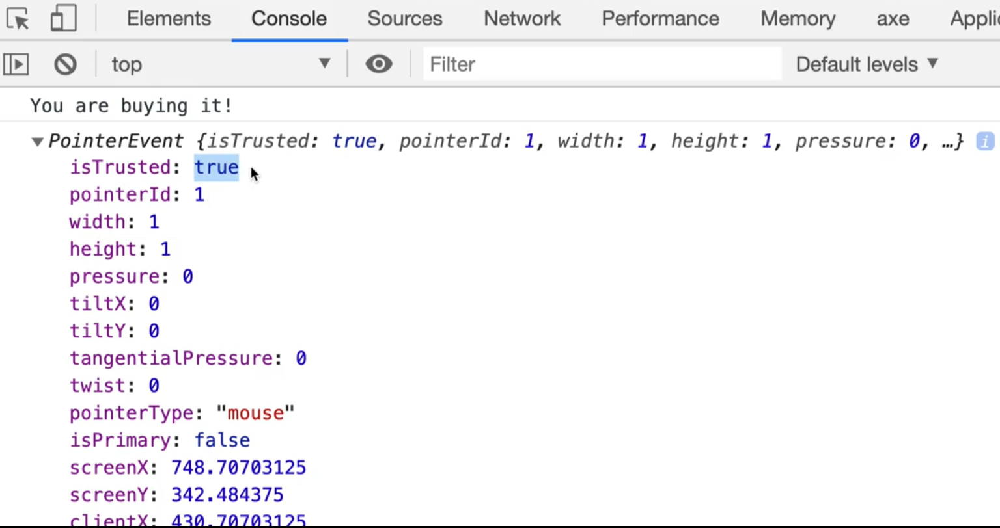 4:18

If you expand the event, you will see all sorts of things. 

**isTrusted**: this is a boolean that will tell you if the click was actually coming from someone's mouse (because it is possible to fake event clicks). If you are making a game, you probably won't want someone to programmatically click on items. 

**pressure**: on newer iPads and other devices, there is pressure sensitivity. 

It tells us `screenX`, `screenY`, `clientX`, `clientY`, `pageX` and `pageY`. Those are details as to where in the screen and where in the page the person has clicked, as well as a bunch of other information like what element was clicked on. 

The one we are interested in is `target` and `currentTarget`. 

Within `handleBuyBackButtonClick`, log `event.target`. 

When you refresh and click on different buttons, it will show you which button the user has clicked on. 

 5:43

That is very useful because we could do something like add a data attribute, such as `data-price=""`, like so 👇

```html
<button data-price="100" class="buy">Buy Item 1</button>
<button data-price="200" class="buy">Buy Item 2</button>
<button data-price="300" class="buy">Buy Item 3</button>
<button data-price="400" class="buy">Buy Item 4</button>
<button data-price="500" class="buy">Buy Item 5</button>
<button data-price="600" class="buy">Buy Item 6</button>
<button data-price="700" class="buy">Buy Item 7</button>
<button data-price="800" class="buy">Buy Item 8</button>
<button data-price="900" class="buy">Buy Item 9</button>
<button data-price="1000" class="buy">Buy Item 10</button>
```

 That allows you to go into the `handleBuyButtonClick` function and add thefollowing code 👇

```js
 function handleBuyButtonClick(event){
  console.log('You are buying it!!');
  console.log(event.target.dataset);
}
```

Now when you click on a specific button, it should show you the dataset in the console.

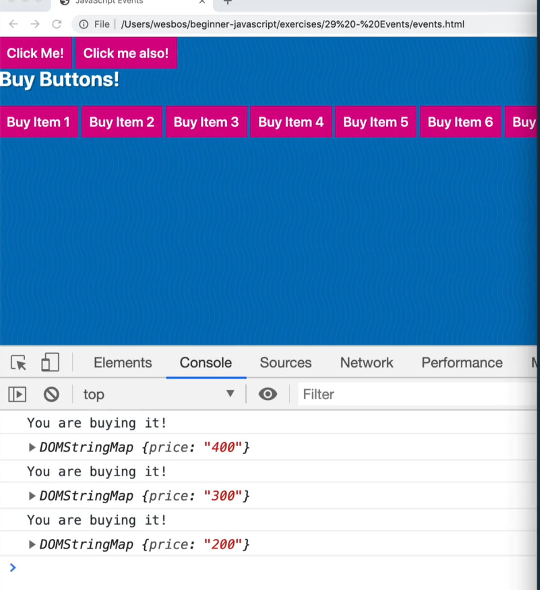 6:23

And if you do `dataset.price`, it will return the price.

 6:27

If you do log `typeof event.target.dataset.price)`, you will see that the price is a string, so tiy need to convert it. 

`parseFloat(price)` will keep the decimals whereas `parseInt()` will not.  

```js
console.log(parseFloat(event.target.dataset.price));
```

Now you get a true number. 

 6:47

To recap: the event object contains all this information about what happened in this event, such as what type of event it was (mouseclick  etc), the target, and then once you have the target, you can access anything you want about that target.

What Wes likes to do is 👇

```js
const button = event.target;
```

This allows you to do 👇

```js
console.log(button.textContent);
```

You can access anything about that specific element using `event.target` 

There is also another property, which you should log

```js
event.currentTarget
``` 

 7:57

You might notice that you get the same thing. 

What is the diferent between **event.target** and **event.currentTarget**?

To demonstrate, log both and then also log a comparison of the two, to see if they are the same element, like so 👇

```js
function handleBuyButtonClick(event){
  const button = event.target;
  // console.log(button.textContent);
  // console.log(parseFloat(event.target.dataset.price));
  console.log(event.target);
  console.log(event.currentTarget);
  console.log(event.target === event.currentTarget);
}
```
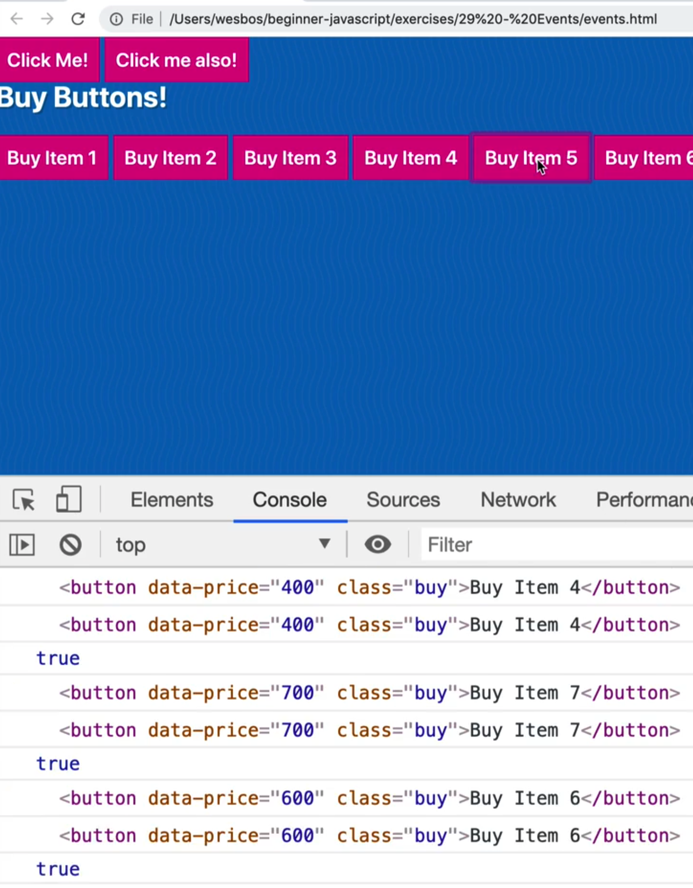 8:22

It returns true. 

So what is the difference?

The difference come in when there are elements nested inside of the element that you are listening to.

Take all the numbers in our buttons and wrap them in a strong tag like so 👇

```html
<button data-price="100" class="buy">Buy Item <strong>1</strong></button>
```

What happens if you click on the number in the button?

8:58

 

In this instance we are clicking on the button and on the strong tag. 

`event.target` is the thing that actually got clicked.

`event.currentTarget` is the thing that fired the event listener.

In most cases, you probably want to reach for `event.currentTarget` rather than `event.target`. Although it is useful to know whether someone clicked an element inside of the element that the listener is on, or did they click on the actual element with the listener.

That happens very often (having click events on elements that contain other elements). 

Let's say we had this scenario:

```js
window.addEventListener('click', function(){
  console.log('you clicked the window');
})
```

Now, when you click anywhere on the HTML page, it will show YOU CLICKED THE WINDOW in the console. 

If you click on the `h2`, it will still show you clicked on the window. B

ut if you click on one of the buttons, are you click on the window, or on the button? 


What happened is that both the window event listener fired, and the `handleBuyButtonClick` fired. We technically clicked on both of them. 

### Propagation

It is possible to be clicking on multiple things at a certain time. That is what is referred to as **propagation**. 

When we clicked the strong tag, what happens is the event bubbles up. 

Meaning we clicked on the strong tag, but we also clicked on the button, and then we also clicked on the body, and the HTML tag, and the window, and the google chrome browser etc, etc. 

 11:14

Although we just clicked on the strong tag, the browser and operating system are also listening to that event. 

The way you can prevent that is with a method on the event that is called `stopPropagation`.  

Within `handleBuyButtonClick`, add the following `event.stopPropagation();`. 

Now when you refresh the HTML page, if you click anywhere on the window, the window click event will fire, but if you click on the button, it will not. 

The window listener doesn't fire because we stopped it. 

What is cool about that is we can modify the window event listener to log the `event.target`, like so 👇

```js
window.addEventListener('click', function(event){
  console.log('you clicked the window');
  console.log(event.target);
})
```

Now anytime we click on something, it will show us what we are actually clicking on. 

So even though we are listening on the window, it will show what the actual element you clicked on is, whether it's a `button` or an `h2`. 

 13:28

Events bubble up, and if we want to stop them from bubbling up, we run `stopPropagation()` and there is a way to flip that: **capture**. 

**Capture** is kind of like the opposite.

This is a diagram from W3 (those are the people who decide how Javascript works, how the browsers work, and how events happen) 👇

 14:11

If you have an element that is very low in the DOM, like a `td` (or in our case, a button), and we are listening on the `td`, when someone makes a click, we actually are clicking on the document, then clicking on the html, then the body, the table, and then finally end up clicking the button. 

If there were divs and other things wrapped inside, the click would go through those as well because it goes through every single element along the way. 

It doesn't do anything, but it is keeping track of where it passed through. 

Then, the event starts to bubble up. 

Once it gets to the very lowest DOM node it can find (a raw buy button in our case or a strong tag), and then it begins what is called **bubbling**. 

What that means is it will trigger a click on the strong tag, then a click on the button, then on the body, the html and finally the document. That is what is meant by **bubbling up**.  

We do have the ability to stop the event as part of the capture phase. 

The `handleBuyButtonClick` function happens during the bubble phase (while it is going back up). 

However, there is an option for when you listen to any event, to listen during the capture phase. 

That means that if we want to listen for a click on the window first and then stop it from going any future, we can do that. 

To do that, we need to add a third argument to `addEventListener`. 

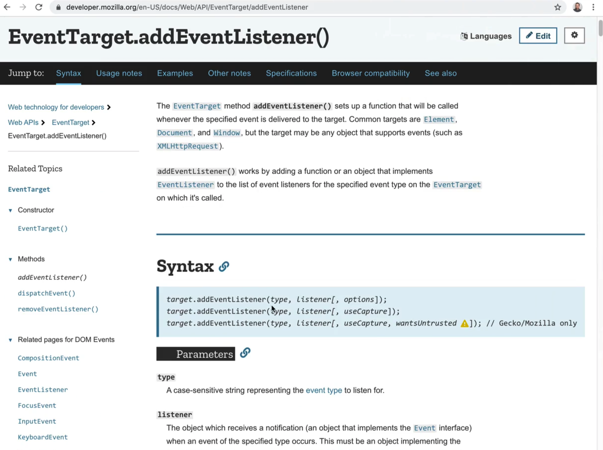 16:18

This can be confusing because `addEventListener` has 3 different ways to call it. 

Typically, the first one is the most modern way to call it. 

It used to be that `addEventListener` took a boolean as the 3rd parameter which specified whether to use capture or not.  But now, they have an `options` object that needs to be passed through.

 16:34

We will be passing the `options` object which has a few options such as capture.

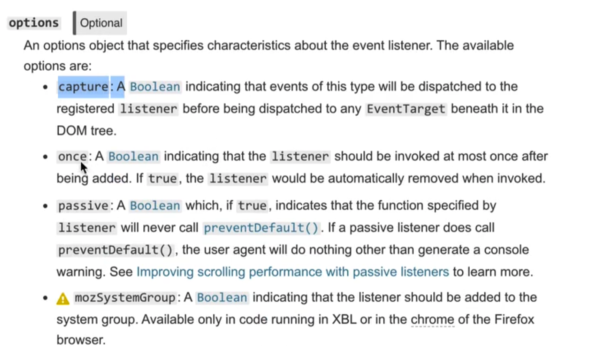 16:48

Go to the `window.eventListener` and pass in `options` as the 3rd parameter. 

1. The first parameter is the event type
2. The second argument is the function that should be run
3. The third is the options object

```js
window.addEventListener(
  "click",
  function(event) {
    console.log("you clicked the window");
    console.log(event.target);
  },
  //{ capture: true }
);
```

We will really quickly comment out the `{capture:true}` and refresh the HTML pages so we can see the order at which it happens. 

Inside of `handleBuyButtonClick`, at the beginning of the function log "You clicked a button" and temporarily comment out `stopPropagation()`. 

Now, if you click on the button, you will see that first it says "You clicked on a button" and then it says "YOU CLICKED THE WINDOW". 

 18:11

If you uncomment `{capture:true}` on the window eventListener, when you refresh the page and click the button, you will first get the window log and then the button. 

 18:36

The order at which the events are fired goes top down, rather than bubbling up. 

Capture goes down. Bubble goes up. 

Now within the window event listener, add 👇

```js
event.stopPropagation();
``` 

That will allow us to stop the event from propagating down, rather than bubbling up. 

Now if you click a button, you will see that the `handleBuyButtonClick()` will never be run. 

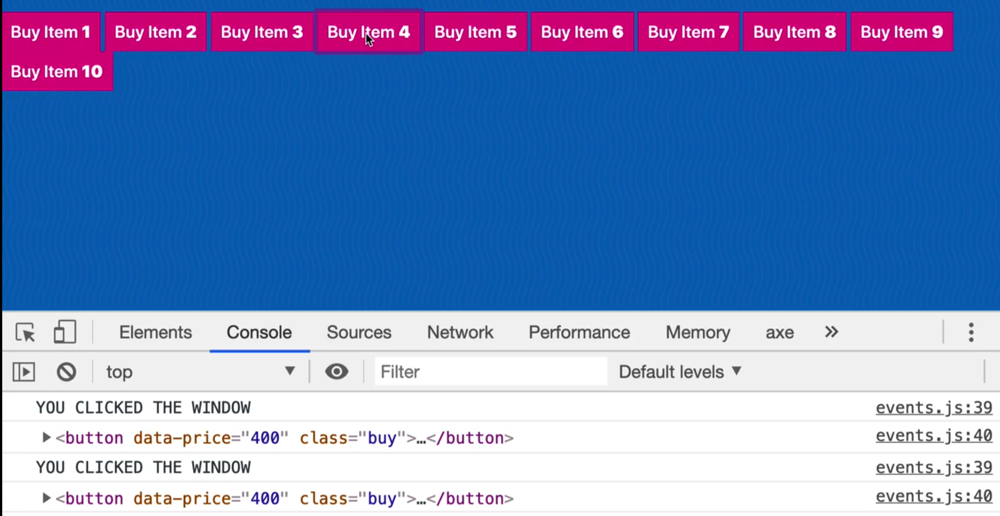 19:10

All of that is good to know, but the capture functionality does not come up very often in day to day development, but it is often an interview question about how the intricacies of events work. 

Most of Wes' career has been spent listening to clicks on lower level elements and stopping the propagation from handlng when you click on the element so that things that are higher that are also listening for clicks do not also fire that specific thing. 

A few more things to go over again. 

The event being passed the function here is just a placeholder, you could call it anything. 

```js
function handleBuyButtonClick(event) {
  const button = event.target;
  // console.log(button.textContent);
  // console.log(parseFloat(event.target.dataset.price));
  console.log(event.target);
  console.log(event.currentTarget);
  console.log(event.target === event.currentTarget);
  // stop this event from bubbling up
  event.stopPropagation();
}
```

For example this would work exactly the same 👇

```js
function handleBuyButtonClick(e) {
  const button = e.target;
  // console.log(button.textContent);
  // console.log(parseFloat(e.target.dataset.price));
  console.log(e.target);
  console.log(e.currentTarget);
  console.log(e.target === e.currentTarget);
  // stop this event from bubbling up
  e.stopPropagation();
}
```

Now let's look at the window's event listener a little closer. 

Modify the listener like so 👇

```js
window.addEventListener(
  "click",
  function(event) {
    console.log("you clicked the window");
    console.log(event.target);
    console.log(event.type);
    console.log(event.bubbles);
  },
  { capture: true }
);
```

If you refresh the HTML page and click somewhere you should see something like the following 👇

 21:24

The properties we logged to the console tell us what we clicked, the type of event (a click) and if the event is going to bubble or not. 

That specifies whether the event handler has a `stopPropagation()` call within it. 

If you modify the window event to include `event.stopPropagation()` and then console.logged `event.bubbles`, it would return false. 

Let's go over one last thing. 

In the HTML page, add the following image element right before the script tag 👇

```html

```

Now in our javascript, grab it and listen to the `mousemove` event.

```js
const photoEl = document.querySelector(".photo");
photoEl.addEventListener("mousemove", function() {
  console.log(e.currentTarget);
});
```

If you add the following, you will get an error in the console saying 
>Uncaught ReferenceError: e is not defined

That is because we forgot to pass the event parameter. 

Modify the code as shown below so we are passing the event as a parameter to the anonymous function.

```js
photoEl.addEventListener("mousemove", function(e) ...
```

Now, whenever you move your mouse anywhere over the image, that event is fired millions of times because it is triggered on every movement of the mouse.

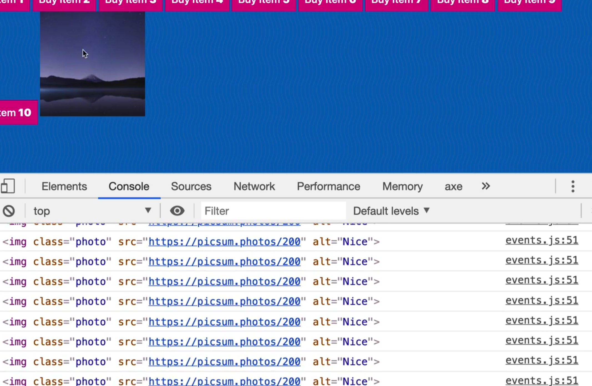 23:05

Add `console.count(e.currentTarget);`. 

That will tell us how often something has fired on that specific thing. 

 23:13

There is also `mouseenter` events which only get triggered when you leave and enter an element. 

### `this`
Now we are going to talk about the word **this**. 

Within the `photoEl` event listener function, log `this`. 

What will that log? We have not passed in `this` as a parameter.. can we just use that variable? 

You can. 

That is because `this` is a special word in Javascript, a "reserved" word. 

Add the following 👇

```js
photoEl.addEventListener("mousemove", function() {
  console.log(e.currentTarget);
  console.log(this);
});
```

When you hover over the image, you should see 👇

 24:02

It is exactly the same thing. 

So if you have a callback function, and you want to reference the element that the event was called against, the `this` keyword will surface that for you.

We will go into the `this` keyword more in the future but for now, the way we can remember it is that the `this` keyword is going to be equal to whatever is to the left of the dot. 

If we called a method called `addEventListener`, look to the left of it and that is what `this` will be equal to. 

Why are there two ways to reference the element (`e.currentTarget` and `this`)? 

And which should you use?

The `this` keyword has a bit of a downside which is that if you change the anonymous function we are passing to the `photoEl` event listener to an arrow function, the `this` keyword is no longer scoped to that element. 

```js
photoEl.addEventListener("mousemove", e => {
  console.log(e.currentTarget);
  console.log(this);
});
```

That is an upside of arrow functions, meaning if you are in a scenario where you don't want to change what `this` is scoped to (such as in a nested function), and you don't want to change what the keyword `this` is scoped to and you can get an arrow function to get around that. 

Because of that, Wes recommends not to use `this` in event listeners or callbacks, always use `e.currentTarget` or `e.target`. 

---

## 31 - Events - Prevent Default and Form Events

In this video, we are going to dive into the `preventDefault()` method that exists on the event (which you will likely use all the time) and working with forms. 

Working with forms, inputs, clicks and hovers will likely be things you spend a lot of time working with in javascript. 

In our `/29 - Events` directory, we have a `forms.js` and `forms.html` file. The javascript file should be empty. 

Add a log of it works and refres hthe forms page. 

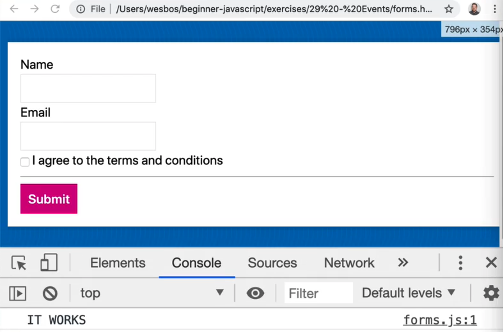 00:48

### preventDefault

There are a few HTML elements that have default functionality when they are used. 

Let's say you have an link to an html page, like so 👇

```html
<a class="wes" href="https://wesbos.com">Wes Bos</a>
```

When you click the link, it takes us to the `href`, like we would expect. 

Now you we can do is stop the default action of the browser and instead handle the event with javascript. 

In the js file, select the link and then listen for a click on it, like so 👇

```js
const wes = document.querySelector(".wes");
wes.addEventListener("click", function(event) {
  console.log(event);
});

```

When you click the link, you will see the event in the console for a split second before you are redirected to the next page. 

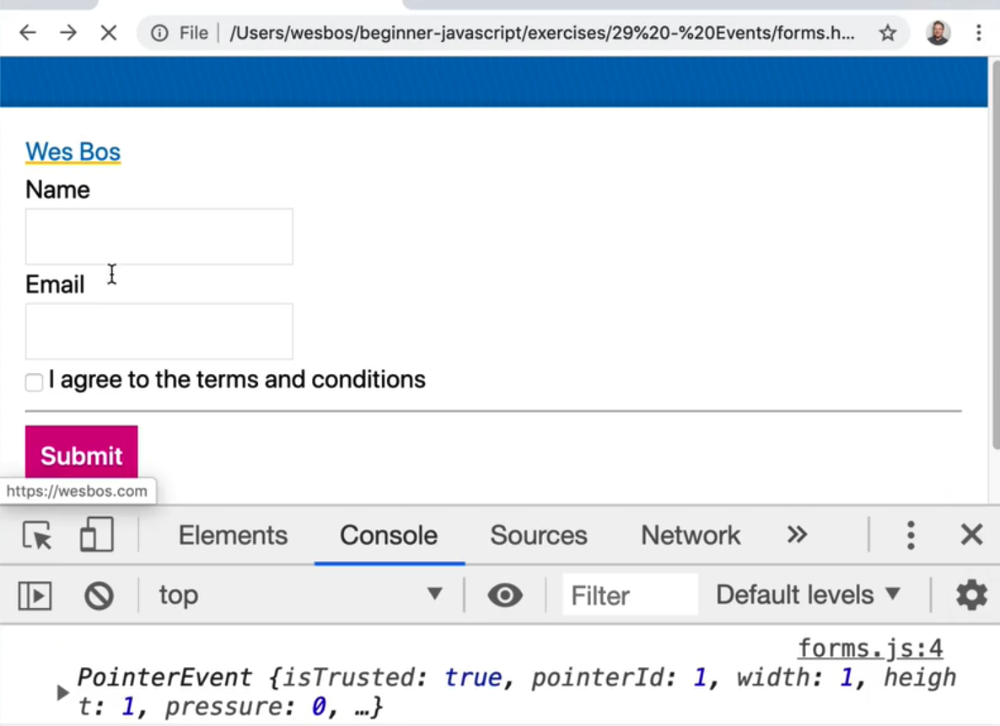 1:52

_**Helpful Tip**: If you need to log something but you are being redirected and the console is being cleared, you can click the "cog" icon in the chrome dev tools and check on "preserve log" to not clear the console when you navigate to another page._

So the default of a link is to change the page, however if you call `event.preventDefault()` within the event listener, it will prevent the default thing from happening. In this case, the link will not redirect us. 

Let's do an example where before we redirect the user, we first wanted to ask them for some information. 

se `confirm` to confirm the redirect before you redirect them, like so 👇

```js
wes.addEventListener("click", function(event) {
  console.log("YOU CLICKED IT");
  event.preventDefault();
});
```

 4:10

Now when you refresh the page and click the link, you will get an alert asking you if you wish to proceed. 

If you select OK, the console will show true which is the value of `shouldChangePage`. 

Move the `eventDefault` call to the top of the anonymous function. 

That allows you to conditionally redirect the user based on the value of `shouldChangePage`, like so 👇

```js
wes.addEventListener("click", function(event) {
  event.preventDefault();
  const shouldChangePage = confirm(
    "This website might be malicious! Do you wish to proceed?"
  );
  if (shouldChangePage) {
    window.location = event.currentTarget.href;
  }
  console.log(shouldChangePage);
});
```

`event.currentTarget.href` will give you the value of the href attribute which is the url you need to redirect the user to manually. 

Now when you click the link, and hit okay in the alert dialogue that comes up in the browser, you will be redirected. 

If you were to hit "Cancel" rather than OK, you would not be redirected. 

Another way you could achieve the same thing is if you moved `event.preventDefault()` like so, 👇

```js
wes.addEventListener("click", function(event) {
  const shouldChangePage = confirm(
    "This website might be malicious! Do you wish to proceed?"
  );
  if (!shouldChangePage) {
    event.preventDefault();
  }
  console.log(shouldChangePage);
});
```

Now `preventDefault` will only be called if the user does not click okay, in which case you do not want to redirect the user which `preventDefault` will prevent from happening. 

This gives us the exact same functionality, but this time you don't need to touch `window.location`. 

What other sort of defaults are there on a page? 

Another common one is submitting a form element. 

Let's add a name attribute to the form. 

The best way to select a form via Javascript is to give it a name, rather than a class.

Call this form `signup` and select it in our javascript.

If you want to select an element by it's name in javascript, you use an attribute selector. This is standard in CSS as well.

```js
const signupForm = document.querySelectorAll('[name="signup"]);
```

Take the sign-up form and add an event listener. However, instead of listening for a click,listen for a `submit` event. 

When someone submits a form, the event will fire and give you access to the form, like so 👇

```js
signupForm.addEventListener("submit", function(event) {
  console.log(event);
  event.preventDefault();
});
```

Now if you put your name and email and click submit, you will see in the url the form values that you entered as parameters

 7:03

More often than not, you don't want to submit the form to the server but you often want to stop the form from submitting, grab those details with JS and continue.

N_ote: When Wes is working with forms, he often gives the form inputs a default value so he doesn't have to keep entering the values every time he wants to test it. You can do the same by modifying your email and name inputs to have attributes such as `<input type="text" id="name" name="name" value="Wes Bos">`._

Now when you submit the form, nothing is happening, you just see the event logged.

What you can do now is check whether the terms and conditions have been checked. 

You could just put a required attribute on the input boxes like so `<input required type="checkbox" id="agree" name="agree">`. 

Now if you were to refresh and try to submit, you would see this little zerror. 

 8:11

In some cases however you want to do extended validation. 

For example maybe you want to make sure the person's name is not Chad. 

To do that you would do the following:

Grab the name input from the form. 

Within the listen, add the following log to the listener so you can see what you are working with, as  shown below 👇

```js 
console.dir(event.currentTarget);
``` 

Hit submit in the form. You should see something similar to what is shown below. 

 8:51

You might notice that there are properties inside of the form object with each of input names. 

There is a name `property` and a 1 property. 

 9:09

There are two ways you can  grab the fields from the form. 

You can do the following 👇

```js
signupForm.addEventListener("submit", function(event) {
  event.preventDefault();
  console.log(event.currentTarget.name);
  console.log(event.currentTarget.email);
});
```

 9:26

Now add `.value` to both of those inputs like so 👇

```js
console.log(event.currentTarget.name.value);
console.log(event.currenTarget.email.value);
```

 9:30

That will give you the actual values that are in the input boxes. 

The reason why those are available to us is because the inputs have a name attribute on them. 

One has a name of `name` and the other of `email`. There is also one with `agree`.

With a checkbox, you don't use `.value`, you would use `.checked` like so 👇

```js
console.log(event.currentTarget.agree.checked);
```
That will return true depending on whether it is checked or not. 

That is the easiest way to get the inputs off a form. 

However you could have also done something like below 👇

```js
event.currentTarget.querySelector('name="email"]');
```

However there is no reason to actually run `querySelector` if you are using proper names. 

That is a good reason to have valid semantic HTML by giving your inputs proper names. 

Now put the name input value in a variable and check whether it contains the name Chad. 

```js
signupForm.addEventListener("submit", function(event) {
  const name = event.currentTarget.name.value;
  if (name.includes("chad")) {
    alert("Sorry bro");
    event.preventDefault();
  }
});
```

Now if you refresh the page and enter the name wes in the form and hit submit, the page will refresh and the form will submit. 

However if you change the name to Chad, you will see an alert and the form will not submit.

_Aside: You might notice that even if you entered the name Chad with an uppercase C, it still works. That is because a string.includes() is not case sensitive. If you want it to be case sensitive, you have to use a **regex** which is something we will cover in the future._

### Other Types of Events with Form Inputs

You have `keyup`, `keydown`, `focus`, `blur` and a whole bunch of different types. 

Take the signup form name input, and add an event listener that listens to the keyup event. 

Make a function called `logEvent` which takes in one parameter which will be named `event`. Inside of the function, log `event.type.`. 

```js
function logEvent(event) {
  console.log(event.type);
}

signupForm.name.addEventListener("keyup", logEvent);
```

Now when you type anything in the name field, you will see `keyup` getting called many times in the console. 

You can also log the `event.currentTarget.value` to get what the user has typed into the input. 

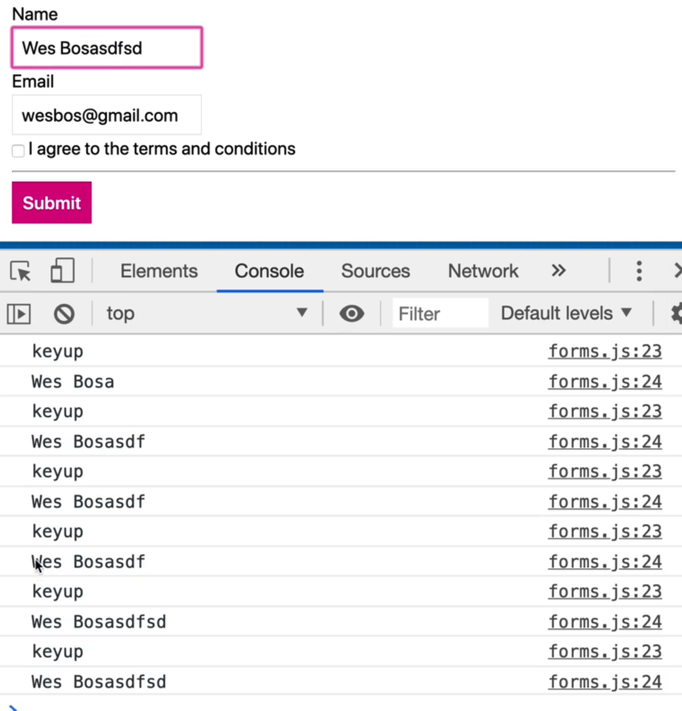 13:43

This is useful if for example you don't want to allow certain numbers or letters being used in the input, you can simply just prevent the default from happening. You would do that on the `keydown`. 

Duplicate the `keyup` event listener and paste it right below and modify the event to `keydown` like so, 👇

```js
signupForm.name.addEventListener("keydown", logEvent);
```

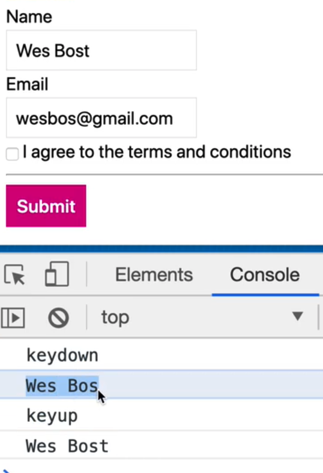 14:20

This logs the keydown event and the keyup event. 

The keydown event will tell us what the user had in the input, whereas the `keyup` event will tell us what the value is. 

There is also also have `focus` and `blur`. 

Those are events that happen when you focus into an input and when you focus out of it. 

The same goes with tabbing, it will trigger a focus and blur event as you go between inputs. 

That can be used for showing styling, or recording info like how long people spend on specific inputs. 

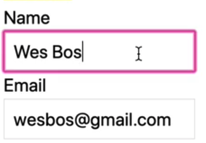 15:00

There are some more events on form elements that we will get into in the future but those are the ones that Wes finds himself using the most often. 

--- 

## 32 - Events - Accessibility Gotchas and Keyboard Codes

Making a website accessible means that you are making it usable to everyone and anyone, regardless of what disability they may have, or what input device they are using, or what situation they are currently in. 

If HTML is marked up correctly, it will be accessible. 

However, what often happens is Javascript developers will often add code that only  works with the mouse for example, and therefore aren't accessible to anyone. 

In this video, we will cover the common pitfalls that happen in Javascript. 

Most accessibility goof-ups happen not because someone is purposely trying to prevent a certain type of user from accessible the website. 

They are typically accidental and the developer just did not know what to look for or check to ensure it's still accessible. 

### Difference between Buttons and Links

The difference between buttons and link is a big accessibility issue. 

Buttons are meant to be used for actions that happen inside of an application. 

Links on the other hand are used to change the page. 

Do not mix those up. Links are not meant to be used where buttons are. 

Wes sees code like this all the time 👇

```js
<a href="#">Save</a>
```

Then the developer will add a click event via javascript to the a tag and `preventDefault`, and then perform some sort of action. 

However, that is not a use-case for a link because that "Save" click doesn't redirect you to anywhere, and thus is not a link. 

That is a good use case for a button (an action within your application or website). 

It's still fine to prevent default on a specific link. 

For example, on twitter, if you try to click "tweets and replies" while not logged in, you will see a modal popup saying "You are not logged in". 

 2:35

That is an example of a valid use case for using prevent default with a link. 

When you need to do something, don't mix up buttons and links.

###  Keyboard Accessibility

Elements that are not keyboard accessible should not have clicks registered on them, unless you need to. 

For example, let's say you have an image like so:

```js

```

Via javascript, select the photo and add a click event listener. 

```js
const photo = document.querySelector(".photo");
photo.addEventListener("click", function() {
  console.log("you clicked the photo");
});
```

There are plenty of valid use cases for clicking on a photo. 

For example, maybe it will open up a larger version of that photo, or you want to draw on the photo or zoom it in. 

If you refresh the HTML page and click on the photo, you will see "You clicked the photo" logged every time you click it. 

If you threw your mouse away, using the tab button on your keyboard, you should be able to tab through everything on the browser. 

However, you will not be able to click on the photo with only the keyboard. 

That is a problem because if the user doesn't have a mouse or they are unable to use a mouse, then they can't use that part of your website. 

An easy solution is giving the element the following attribute: `role="button"`. 

If you mean for something to be a button that is not a button tag, such as a div, if you mean for it to be used like a button, you should add the role attribute like so 👇

```html
<div role="button" tabindex="0"> click me </div>
```

You also need to add the `tabindex` attribute when you add the `role="button"`. 

You will likely set that to 0, which will put that element in the flow so people can tab to it with their keyboards. 

For the image, you could give it a role of button, but it's easier to put the image actually inside a button, like so 👇

```html
<button>
       
</button>
```

If you modified the code like so instead, like so 👇

```html
<div role="button" tabindex="0">Click me </div>

```

Now if you tab using your keyboard, you can go back and forth between the image and the div with button role. 

 6:26

If you focus on the image like shown above and hit the enter key, unlike some other buttons and elements, it will not trigger a click. 

If that is the case, you have to go back to your javascript and move the anonymous function that you pass to the click event listener and make it named function. 

Modify the click event listener to call `handlePhotoClick` instead and then duplicate the event listener and add another listener but on the `keyup` event this time, like so 👇

```js
function handlePhotoClick() {
  console.log("you clicked the photo");
}
photo.addEventListener("click", handlePhotoClick);
photo.addEventListener("keyup", handlePhotoClick);
```

Now, when you go to the image, you can click on over to it. 

You might notice that when upi tab to the image, the console is logging "You clicked the photo", even though you haven't actually clicked it yet (we only care about the enter key).

How can you only listen for the enter key?

The event has a bunch of information about this. 

The event object should have `event.key` and `event.keycode`. `event.key` is more modern and supported in more browsers. 

Every single key on an event will give you a bunch of information.

Wes has a website, http://keycode.info, on which you can press any key and it will give you the meta information about that key. 

 8:09

There is `event.key`, `event.which`, `event.code` and `event.key`.  `event.key` is the best way to go about it.

Now what we can say is if the event is a click or if the `event.key` equals enter like so: 👇

```js
function handlePhotoClick(event) {
  if (event.type === "clicked" || event.key === "Enter") {
    console.log("you clicked the photo");
  }
}
```

Now if you try tabbing and then pressing enter when on the image, you will see "You clicked the photo" logged, meaning it is accessible.

Accessibility is something that people tend to forget about, but it only takes about 10 minutes of work to ensure it's accessible. 

---
